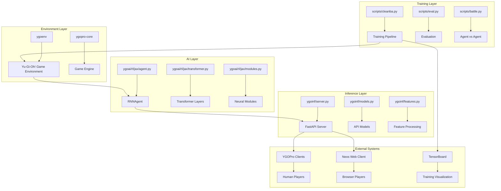

# System Architecture Overview

## System Purpose
The YGO Agent system is a comprehensive AI platform for mastering the Yu-Gi-Oh! trading card game through deep reinforcement learning. The system trains neural network agents to achieve superhuman performance by learning optimal strategies through self-play and human gameplay data, then deploys these agents for human-AI gameplay through YGOPro-compatible clients.

## Core Architecture

### High-Level Components

**Text Architecture:**

```
┌─────────────────┐    ┌─────────────────┐    ┌─────────────────┐
│   Training      │───▶│   Environment   │───▶│   Inference     │
│   (scripts/)    │    │   (ygoenv/)     │    │   (ygoinf/)     │
└─────────────────┘    └─────────────────┘    └─────────────────┘
│                       │                       │
▼                       ▼                       ▼
┌─────────────────┐    ┌─────────────────┐    ┌─────────────────┐
│ Neural Network  │    │ Game Engine     │    │ API Server      │
│ (ygoai/rl/jax/) │    │ (ygopro-core)   │    │ (FastAPI)       │
└─────────────────┘    └─────────────────┘    └─────────────────┘
```

**Visual Architecture:**


### System Data Architecture

[How is data organized, stored, and accessed across the system?]

```
┌─────────────┐    ┌─────────────┐    ┌─────────────┐
│   Model     │    │   Game      │    │   Training  │
│ Checkpoints │◄──►│   State     │◄──►│   Data      │
│   (.flax)   │    │   (Memory)  │    │   (Buffers) │
└─────────────┘    └─────────────┘    └─────────────┘
        ▲                   ▲                   ▲
        │                   │                   │
[Serialization]    [State Management]    [Experience Collection]

```

### Integration Architecture

[How does this system connect to external systems?]

```
YGOPro Clients ──HTTP API──┐
                           ▼
Neos Web Client ──CORS─────┤ YGO Agent System ├────Model Checkpoints
                           ▲            │
TensorBoard ──Logging──────┘            └────Training Scripts

External Dependencies:
├── ygopro-core (Game Engine)
├── envpool (Environment Pooling)
├── JAX (Computation)
├── Flax (Neural Networks)
└── FastAPI (Web Server)
```

## System Boundaries

### Inputs

[What comes into this system and from where?]

- **Training Data**: Deck files (.ydk), card embeddings, game replays
- **Game State**: Real-time Yu-Gi-Oh! game state from YGOPro clients
- **Configuration**: Training parameters, model architecture, server settings
- **Human Interaction**: Gameplay actions from human players via clients

### Outputs

[What this system produces and where it goes]

- **Trained Models**: Neural network checkpoints for deployment
- **Action Predictions**: Real-time AI decisions for gameplay
- **Training Metrics**: Performance statistics and visualization data
- **Game Replays**: Recorded games for analysis and debugging

### External Dependencies

[Critical external systems this depends on]

- **ygopro-core**: Yu-Gi-Oh! game engine for rule enforcement and state management
- **envpool**: High-performance environment pooling for parallel training
- **JAX**: Numerical computing framework for neural network operations
- **Flax**: Neural network library for model definition and parameter management
- **FastAPI**: Web framework for inference server API

## Quality Attributes

### Performance Characteristics

[System-level performance profile based on directory analysis]

- **Training Throughput**: 1000+ steps per second on single GPU, scales with multi-GPU
- **Inference Latency**: 10-100ms per prediction depending on model size
- **Memory Usage**: Scales with batch size and model parameters (128MB-2GB typical)
- **Concurrent Sessions**: Supports multiple simultaneous AI gameplay sessions

### Reliability Patterns

[How does the system handle failures?]

- **Fault Tolerance**: Checkpoint-based training recovery, graceful API error handling
- **Recovery**: Automatic model reloading, state reconstruction from action history
- **Monitoring**: TensorBoard logging, API health checks, performance metrics

### Security Considerations

[Security patterns identified across directories]

- **Authentication**: None required - local network deployment model
- **Authorization**: No access control - designed for trusted local networks
- **Data Protection**: No sensitive data processing - game state only

## Evolution History

[Based on git analysis and code patterns - how has this system evolved?]

- **Original Design**: Single-agent training with basic neural network architecture
- **Major Changes**: 
  - Switched from PyTorch to JAX for better performance
  - Added transformer-based architecture (Noam)
  - Implemented RNN variants (LSTM, GRU, RWKV)
  - Added inference server for human-AI gameplay
- **Current State**: Multi-agent training with distributed computing, comprehensive inference system

## Technical Debt Assessment

[Based on complexity analysis - where are the main technical debt areas?]

- **Code Quality**: Limited test coverage, especially for neural network components
- **Architecture**: Tight coupling between training and inference systems
- **Performance**: Memory usage optimization needed for large models
- **Documentation**: Incomplete API documentation, missing deployment guides

## System Data Flow

### Training Data Flow

```
Deck Files → Environment Setup → Game Generation → Experience Collection → Model Training → Checkpoint Storage
     ↓              ↓                    ↓                    ↓                    ↓                    ↓
  .ydk files    ygoenv.make()      Parallel Games      Training Buffers    cleanba.py        .flax files
```

### Inference Data Flow

```
Game State → API Request → Feature Processing → Model Inference → Action Prediction → Client Response
     ↓            ↓                ↓                ↓                ↓                ↓
YGOPro Client  FastAPI        ygoinf/features   RNNAgent       Probability      JSON Response
```

### Evaluation Data Flow

```
Trained Model → Environment Setup → Game Execution → Performance Metrics → Analysis Reports
     ↓                ↓                    ↓                ↓                ↓
.flax files     eval.py              Parallel Games    Win Rates        TensorBoard
```

## System Integration Patterns

### Training-Environment Integration

- **Protocol**: Gymnasium-compatible environment interface
- **Data Flow**: Environment provides observations, receives actions, returns rewards
- **Synchronization**: Parallel environment execution with shared model parameters

### Model-Inference Integration

- **Protocol**: JAX/Flax model serialization and loading
- **Data Flow**: Model checkpoints loaded into inference server
- **Synchronization**: Single model instance shared across all prediction requests

### Client-Server Integration

- **Protocol**: HTTP REST API with JSON payloads
- **Data Flow**: Game state sent to server, action predictions returned
- **Synchronization**: Stateful sessions with action index tracking

## Scalability Considerations

### Training Scalability

- **Horizontal**: Multi-GPU distributed training with actor-learner architecture
- **Vertical**: Larger models with more parameters and layers
- **Data**: Parallel environment execution with configurable batch sizes

### Inference Scalability

- **Horizontal**: Multiple server instances behind load balancer
- **Vertical**: Larger server instances with more memory
- **Concurrency**: Thread-safe model sharing across requests

### Storage Scalability

- **Model Checkpoints**: Compressed storage with versioning
- **Training Data**: Efficient buffer management with experience replay
- **Logs**: Rotating log files with configurable retention

## Monitoring and Observability

### Training Monitoring

- **Metrics**: Loss curves, win rates, training speed, memory usage
- **Visualization**: TensorBoard dashboards for real-time monitoring
- **Alerts**: Training failures, performance degradation, resource exhaustion

### Inference Monitoring

- **Metrics**: Request latency, throughput, error rates, memory usage
- **Health Checks**: API endpoint availability, model loading status
- **Logging**: Request/response logging, error tracking, performance profiling

### System Health

- **Resource Monitoring**: CPU, GPU, memory, disk usage
- **Network Monitoring**: API request patterns, client connectivity
- **Error Tracking**: Exception monitoring, failure analysis, recovery metrics 