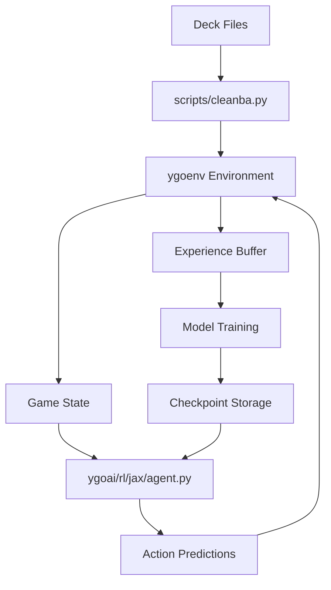
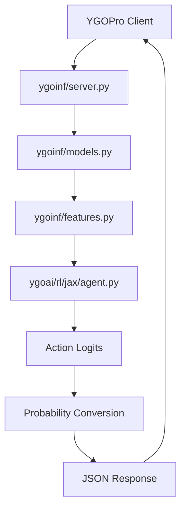
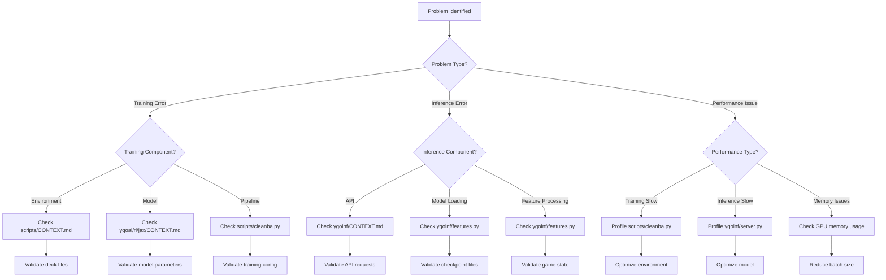

# System Navigation Guide for AI Agents

## Entry Points by Task Type

### Feature Development
**Adding new training capabilities**:
1. **Understand the domain**: Start with `scripts/CONTEXT.md` - understand training pipeline
2. **Identify integration points**: Check `ygoai/rl/jax/CONTEXT.md` for model architecture
3. **Follow the pattern**: Look at similar features in `scripts/cleanba.py`
4. **Implementation path**:
   - Training logic: `scripts/` with training scripts
   - Model changes: `ygoai/rl/jax/` with neural network components
   - Environment integration: `ygoenv/` with game environment
   - Evaluation: `scripts/eval.py` for performance measurement
5. **Testing strategy**: Follow patterns in `scripts/` test structures
6. **Integration**: Update training scripts and model interfaces

**Adding new inference features**:
1. **Understand the domain**: Start with `ygoinf/CONTEXT.md` - understand inference system
2. **Identify integration points**: Check `ygoai/rl/jax/CONTEXT.md` for model interface
3. **Follow the pattern**: Look at similar features in `ygoinf/server.py`
4. **Implementation path**:
   - API endpoints: `ygoinf/server.py` with FastAPI routes
   - Data models: `ygoinf/models.py` with Pydantic schemas
   - Feature processing: `ygoinf/features.py` with inference logic
   - Model integration: `ygoai/rl/jax/agent.py` for model changes
5. **Testing strategy**: API testing with FastAPI test client
6. **Integration**: Update API documentation and client interfaces

### Bug Investigation
**Training issues**:
1. **Start here**: `scripts/CONTEXT.md` - understand training pipeline
2. **Check logs**: TensorBoard logs in `runs/` directory
3. **Trace data flow**:
```
Deck Files → Environment Setup → Model Training → Checkpoint Storage
     ↓              ↓                    ↓                    ↓
  .ydk files    ygoenv.make()      cleanba.py        .flax files
```
4. **Common failure points**: 
   - Invalid deck files in `assets/deck/`
   - Model checkpoint corruption
   - GPU memory issues
   - Environment initialization failures
5. **Diagnostic tools**: TensorBoard for training metrics, JAX debugging tools

**Inference issues**:
1. **Check**: `ygoinf/CONTEXT.md` - understand inference system
2. **Trace**: API request flow through server
3. **Validate**: Model loading and state management
4. **Common causes**: 
   - Invalid game state format
   - Model checkpoint loading failures
   - State inconsistency errors
   - Memory issues with large models

**Model performance issues**:
1. **Check**: `ygoai/rl/jax/CONTEXT.md` - understand model architecture
2. **Trace**: Model forward pass and loss computation
3. **Validate**: Input/output shapes and data types
4. **Common causes**: 
   - Incorrect input preprocessing
   - Model parameter corruption
   - RNN state management issues
   - Memory leaks in JAX computation

### Performance Optimization
**Training performance improvements**:
1. **Profile**: `scripts/cleanba.py` - training pipeline bottlenecks
2. **Bottleneck locations**: 
   - Environment step time in `ygoenv/`
   - Model forward/backward pass in `ygoai/rl/jax/`
   - Data pipeline in training scripts
3. **Optimization**: 
   - Increase parallel environments
   - Optimize JAX JIT compilation
   - Reduce model complexity
   - Use mixed precision training
4. **Validation**: Measure steps per second and memory usage

**Inference performance improvements**:
1. **Profile**: `ygoinf/server.py` - API response times
2. **Bottleneck locations**: 
   - Model inference in `ygoai/rl/jax/agent.py`
   - Feature processing in `ygoinf/features.py`
   - State management overhead
3. **Optimization**: 
   - Model quantization (TensorFlow Lite)
   - Batch inference requests
   - Optimize JAX compilation
   - Reduce model size
4. **Validation**: Measure request latency and throughput

### System Understanding
**Learning the codebase progressively**:

#### Level 1: System Overview
1. **Start**: `agents/ARCHITECTURE.md` - understand system purpose and structure
2. **Then**: `agents/PATTERNS.md` - learn common patterns
3. **Map**: `agents/COGNITIVE_MAP.md` (this file) - understand navigation

#### Level 2: Domain Understanding
1. **Core domain**: `scripts/CONTEXT.md` - training pipeline
2. **Key supporting domains**: `ygoai/rl/jax/CONTEXT.md` - neural network models
3. **Integration patterns**: How directories interact

#### Level 3: Implementation Details
1. **Specific functionality**: `ygoinf/CONTEXT.md` for inference system
2. **Data structures**: Type definitions and schemas
3. **Technical rules**: Validation and calculation logic

## Data Flow Tracing

### Training Flow
[Step-by-step data transformation through the training system]

**Text Flow:**
```
[Deck Configuration]
↓
scripts/cleanba.py → [Environment Setup]
↓
ygoenv/ → [Game Generation]
↓
ygoai/rl/jax/agent.py → [Model Inference]
↓
scripts/cleanba.py → [Experience Collection]
↓
[Training Update] → [Checkpoint Storage]
```

**Visual Flow:**


### Inference Flow
[Step-by-step data transformation through the inference system]

**Text Flow:**
```
[YGOPro Client] → [Game State]
↓
ygoinf/server.py → [API Request]
↓
ygoinf/features.py → [Feature Processing]
↓
ygoai/rl/jax/agent.py → [Model Inference]
↓
ygoinf/server.py → [Action Prediction]
↓
[Client Response]
```

**Visual Flow:**


### Evaluation Flow
[Step-by-step data transformation through the evaluation system]

**Text Flow:**
```
[Trained Model] → [Checkpoint Loading]
↓
scripts/eval.py → [Environment Setup]
↓
ygoenv/ → [Game Execution]
↓
ygoai/rl/jax/agent.py → [Model Inference]
↓
scripts/eval.py → [Performance Metrics]
↓
[Evaluation Report]
```

## Debugging Decision Tree

**Text Decision Tree:**

```
What type of problem?
├── Training Error
│   ├── Environment issue?
│   │   ├── Check: scripts/CONTEXT.md → [environment setup]
│   │   ├── Validate: deck files and configuration
│   │   └── Common causes: invalid deck format, missing files
│   ├── Model issue?
│   │   ├── Check: ygoai/rl/jax/CONTEXT.md → [model architecture]
│   │   ├── Validate: input shapes and data types
│   │   └── Common causes: parameter corruption, shape mismatches
│   └── Training pipeline issue?
│       ├── Check: scripts/cleanba.py → [training logic]
│       ├── Validate: hyperparameters and configuration
│       └── Common causes: learning rate, batch size, memory issues
├── Inference Error
│   ├── API issue?
│   │   ├── Check: ygoinf/CONTEXT.md → [server configuration]
│   │   ├── Validate: request format and state consistency
│   │   └── Common causes: invalid JSON, missing fields
│   ├── Model loading issue?
│   │   ├── Check: ygoinf/features.py → [model loading]
│   │   ├── Validate: checkpoint file and model compatibility
│   │   └── Common causes: corrupted files, version mismatch
│   └── Feature processing issue?
│       ├── Check: ygoinf/features.py → [feature extraction]
│       ├── Validate: input data format and preprocessing
│       └── Common causes: invalid game state, missing cards
└── Performance Issue
    ├── Training slow?
    │   ├── Check: scripts/cleanba.py → [performance bottlenecks]
    │   ├── Profile: environment step time, model inference time
    │   └── Optimize: parallel environments, JAX compilation
    ├── Inference slow?
    │   ├── Check: ygoinf/server.py → [API performance]
    │   ├── Profile: model inference time, feature processing
    │   └── Optimize: model quantization, batch processing
    └── Memory issues?
        ├── Check: GPU memory usage and model size
        ├── Profile: memory allocation patterns
        └── Optimize: batch size, model complexity
```



## Testing Strategy by Component

### Unit Testing

- **Training Logic**: Test training functions in `scripts/`
- **Model Components**: Test neural network layers in `ygoai/rl/jax/`
- **API Endpoints**: Test FastAPI routes in `ygoinf/`

### Integration Testing

- **Training Pipeline**: Test end-to-end training with small models
- **Inference Pipeline**: Test API requests with sample game states
- **Environment Integration**: Test game environment with various decks

### End-to-End Testing

- **Complete Training**: Train small model from scratch
- **Human-AI Gameplay**: Test inference server with YGOPro client
- **Performance Validation**: Measure training speed and inference latency

## Common Development Tasks

### Adding New Model Architecture

1. **Start at**: `ygoai/rl/jax/agent.py` - understand current architecture
2. **Modify**: Add new model components in `ygoai/rl/jax/`
3. **Update**: Training scripts to use new architecture
4. **Test**: Validate with small training run
5. **Document**: Update model configuration in `ygoai/rl/jax/CONTEXT.md`

### Adding New Training Algorithm

1. **Start at**: `scripts/cleanba.py` - understand current algorithm
2. **Modify**: Add new loss functions in `ygoai/rl/jax/`
3. **Update**: Training pipeline to use new algorithm
4. **Test**: Compare performance with baseline
5. **Document**: Update training documentation

### Adding New API Endpoint

1. **Start at**: `ygoinf/server.py` - understand current API structure
2. **Modify**: Add new endpoint with proper validation
3. **Update**: Data models in `ygoinf/models.py`
4. **Test**: API endpoint with test client
5. **Document**: Update API documentation

### Debugging Training Issues

1. **Check**: TensorBoard logs for loss curves and metrics
2. **Validate**: Input data format and preprocessing
3. **Profile**: Training pipeline performance bottlenecks
4. **Test**: Small training run with simplified configuration
5. **Fix**: Address identified issues and retest

### Debugging Inference Issues

1. **Check**: API logs for request/response patterns
2. **Validate**: Model checkpoint loading and state management
3. **Profile**: Inference performance and memory usage
4. **Test**: API endpoints with sample game states
5. **Fix**: Address identified issues and retest

## Performance Optimization Patterns

### Training Optimization

- **Environment Parallelization**: Increase `num_envs` parameter
- **Model Optimization**: Use JAX JIT compilation and mixed precision
- **Data Pipeline**: Optimize experience buffer management
- **Hardware Utilization**: Use multiple GPUs with distributed training

### Inference Optimization

- **Model Quantization**: Convert to TensorFlow Lite for faster inference
- **Batch Processing**: Process multiple requests together
- **Caching**: Cache model parameters and intermediate results
- **Load Balancing**: Distribute requests across multiple server instances

### Memory Optimization

- **Batch Size Tuning**: Reduce batch size to fit in memory
- **Model Pruning**: Remove unnecessary model parameters
- **Gradient Checkpointing**: Trade computation for memory
- **Memory Profiling**: Monitor and optimize memory usage patterns

## Error Recovery Patterns

### Training Recovery

- **Checkpoint Restoration**: Resume from last valid checkpoint
- **Configuration Validation**: Verify all training parameters
- **Resource Monitoring**: Check GPU memory and disk space
- **Graceful Degradation**: Reduce batch size or model complexity

### Inference Recovery

- **Model Reloading**: Reload model from checkpoint on failure
- **State Reconstruction**: Rebuild duel state from action history
- **Error Handling**: Return meaningful error messages to clients
- **Fallback Behavior**: Use default actions when model fails

### System Recovery

- **Health Checks**: Monitor system health and restart on failure
- **Logging**: Comprehensive logging for debugging and recovery
- **Monitoring**: Real-time monitoring of system metrics
- **Automated Recovery**: Automatic restart and recovery procedures 