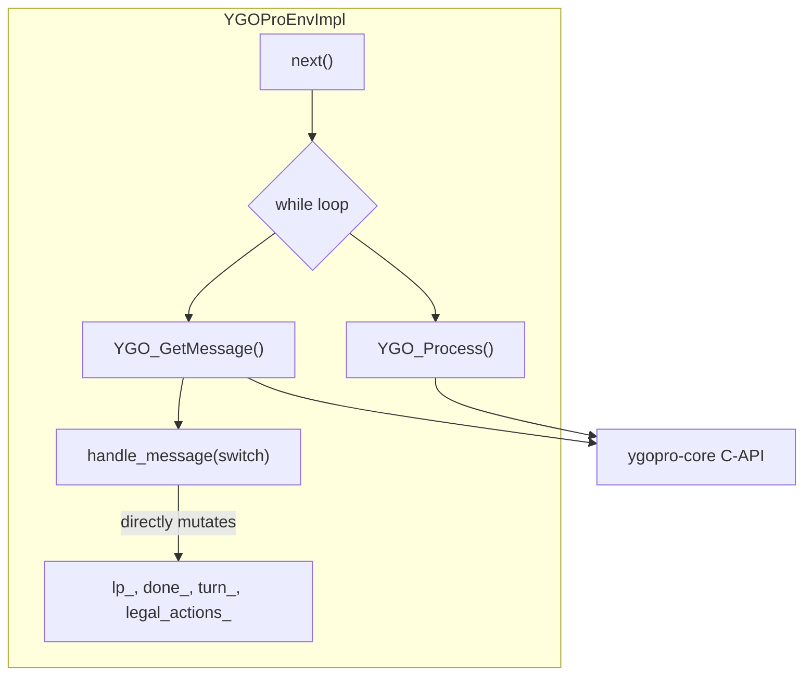
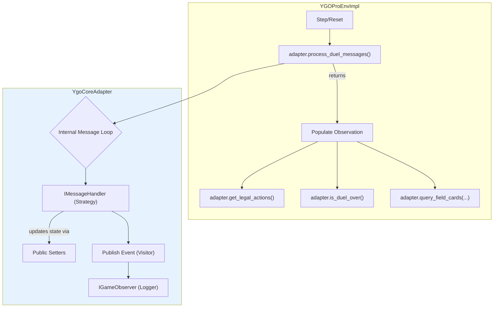

# Appendix: `YGOProEnv` to `YgoCoreAdapter` Refactor Plan

This document serves as a detailed, function-level guide for refactoring the `YGOProEnv` class into a thin wrapper around a new `YgoCoreAdapter` class. The goal is to isolate all direct interactions with the `ygopro-core` C-API into the adapter, leaving `YGOProEnv` to manage environment-level concerns like state, rewards, and player interaction.

---
### Status Key
*   **Pending**: Implementation has not started.
*   **Adapted**: The functionality has been implemented in `YgoCoreAdapter`, but `YGOProEnv` has not yet been updated to use it.
*   **Refactored**: The logic has been fully moved to `YgoCoreAdapter`, or in the case of helper functions, moved to a more appropriate utility file.
*   **Done**: No refactoring was required for this item.
---

## 1. Helper Functions & Data Structures

These are standalone utilities currently within `ygopro.h`. They are not directly part of the `YGOProEnv` class but are used by it.

**Action:** Move these to a new, shared header file, e.g., `ygoenv/ygopro/utils.h`, so both the adapter and the environment can access them if needed.

| Function/Struct | Current Location | Target Location | Notes | Status |
| :--- | :--- | :--- | :--- | :--- |
| `combinations()` | `ygopro.h` | `utils.h` | General-purpose combination utility. | Refactored |
| `sum_to()` | `ygopro.h` | `utils.h` | Helper for `combinations_with_weight`. | Refactored |
| `combinations_with_weight()` | `ygopro.h` | `utils.h` | Used for MSG_SELECT_SUM. | Refactored |
| `msg_to_string()` | `ygopro.h` | `utils.h` | Debugging utility. | Refactored |
| `ls_to_spec()`, `spec_to_ls()` | `ygopro.h` | `utils.h` | Location/spec string conversion. | Refactored |
| `read_decks()` | `ygopro.h` | `utils.h` | Deck reading utility. | Refactored |
| `LegalAction` struct | `ygopro.h` | `ygo_data_types.h` | Becomes a core data structure. | Refactored |
| `Card` class | `ygopro.h` | `ygo_data_types.h` | Methods are now inline in this file. | Refactored |
| `init_module()` | `ygopro.h` | `YgoCoreAdapter` | Becomes a static method on the adapter. | Pending |

---

## 2. Member Variables

The member variables of `YGOProEnv` will be split. The adapter will own everything related to the core duel engine, while the environment will retain variables related to the Gym/EnvPool interface.

| `YGOProEnv` Member | To `YgoCoreAdapter`? | Notes | Status |
| :--- | :--- | :--- | :--- |
| `pduel_` | **Yes** | **Central change.** The adapter will create, own, and destroy `pduel`. | Adapted |
| `buf_` | **Yes** | The buffer for receiving messages from `YGO_GetMessage`. | Pending |
| `data_` | **Yes** | The `byte*` pointer to `buf_`. | Pending |
| `dp_` | **Yes** | Data pointer for reading `buf_`. | Pending |
| `qbuf_` | **Yes** | Buffer for query results. | Pending |
| `spec_` | No | Belongs to the EnvPool environment. | Done |
| `done_` | No | Environment state. | Done |
| `reward_` | No | Environment state. | Done |
| `turn_` | **Yes** | The core engine tracks the turn. Will be retrieved via a getter. | Pending |
| `player_` | No | Player object (e.g., RandomAI, HumanPlayer). | Done |
| `legal_actions_` | No | Actions are an environment-level concept. Populated from a getter. | Done |
| `replay_` | **Yes** | Replay buffer and logic should live with the duel instance. | Pending |
| `m_deck_`, `e_deck_` | **Yes** | The duel engine needs to know the decks to start. | Pending |

---

## 3. Core C-API Wrappers

These are the lowest-level private methods in `YGOProEnv` that call the C-API.

**Action:** These will be moved directly to `YgoCoreAdapter` and will likely become `private` methods there, called by the adapter's public interface.

| `YGOProEnv` Method | Target `YgoCoreAdapter` Method | `YGOProEnv`'s New Implementation | Status |
| :--- | :--- | :--- | :--- |
| `YGO_CreateDuel()` | `YgoCoreAdapter::YgoCoreAdapter(seed)` (Constructor) | `adapter_ = std::make_unique<YgoCoreAdapter>(seed);` | Adapted |
| `YGO_EndDuel()` | `YgoCoreAdapter::~YgoCoreAdapter()` (Destructor) | `adapter_.reset();` | Adapted |
| `YGO_SetPlayerInfo()` | `void set_player_info(...)` | `adapter_->set_player_info(...);` | Adapted |
| `YGO_NewCard()` | `void add_card(...)` | `adapter_->add_card(...);` | Adapted |
| `YGO_StartDuel()` | `void start_duel(...)` | `adapter_->start_duel(...);` | Adapted |
| `YGO_Process()` | `uint32_t process()` | `adapter_->process();` | Adapted |
| `YGO_GetMessage()` | `int32_t get_message(byte* buf)` | `adapter_->get_message(buf);` | Adapted |
| `YGO_QueryCard()` | `CardInfo query_card(...)` | `adapter_->query_card(...);` | Adapted |
| `YGO_QueryFieldCount()`| `int32_t query_field_count(...)` | `adapter_->query_field_count(...);` | Pending |
| `YGO_QueryFieldCard()`| `std::vector<CardInfo> query_field_card(...)` | `adapter_->query_field_card(...);` | Adapted |
| `YGO_SetResponsei()` | `void set_response(int32_t value)` | `adapter_->set_response(value);` | Adapted |
| `YGO_SetResponseb()` | `void set_response(const std::vector<byte>& buf)` | `adapter_->set_response(buf);` | Adapted |

---

## 4. Game State and Logic Functions

These methods in `YGOProEnv` manage the duel's lifecycle and state transitions. The adapter will expose new getter methods to provide state information to `YGOProEnv` after processing duel messages.

| `YGOProEnv` Method | Target `YgoCoreAdapter` Public Method | `YGOProEnv`'s New Implementation | Status |
| :--- | :--- | :--- | :--- |
| `new_duel(seed)` | `(Constructor)` | Initializes the adapter. | Adapted |
| `reset()` | `void reset()` (if needed) or handled by new duel creation. | Calls `adapter_.reset()` and creates a new one. | Pending |
| `next()` | N/A | Calls `adapter_->process_duel_messages()` then uses getters below. | Pending |
| `get_card_code()` | `CardCode get_card_code(...)` | `return adapter_->get_card_code(...);` | Pending |
| `get_card()` | `Card get_card(...)` | `return adapter_->get_card(...);` | Pending |
| `read_u8()`, `read_u16()`, `read_u32()` | Becomes private methods in `YgoCoreAdapter`. | No longer exists in `YGOProEnv`. | Pending |
| `q_read_u8()`, `q_read_u32()` | Becomes private methods in `YgoCoreAdapter`. | No longer exists in `YGOProEnv`. | Pending |
| N/A | `const std::vector<LegalAction>& get_legal_actions() const` | `legal_actions_ = adapter_->get_legal_actions();` | Pending |
| N/A | `bool is_duel_over() const` | `done_ = adapter_->is_duel_over();` | Pending |
| N/A | `PlayerId get_turn_player() const` | `tp_ = adapter_->get_turn_player();` | Pending |
| N/A | `GamePhase get_current_phase() const` | `current_phase_ = adapter_->get_current_phase();` | Pending |

---

## 5. YgoCoreAdapter Public API Mapping

This section defines the precise public interface for `YgoCoreAdapter`. Its primary responsibility is to process the duel engine's message queue and then provide the results to `YGOProEnv` through a clean, getter-based API.

| `YGOProEnv` State/Need | `YgoCoreAdapter` Public Method | Old `YGOProEnv` Implementation | Status |
| :--- | :--- | :--- | :--- |
| Advance the duel state | `void process_duel_messages()` | The `while` loop in `next()` that calls `YGO_Process` and `handle_message`. | Pending |
| Legal actions for player | `const std::vector<LegalAction>& get_legal_actions() const` | The `legal_actions_` member, populated by `handle_message`. | Pending |
| Is the duel finished? | `bool is_duel_over() const` | The `done_` member, set to true after a `MSG_WIN` message. | Pending |
| Reward for a player | `float get_reward(PlayerId player) const` | The `reward_` member, calculated based on the winner from `MSG_WIN`. | Pending |
| Current turn player | `PlayerId get_turn_player() const` | The `tp_` member, updated by `MSG_NEW_TURN`. | Pending |
| Current turn count | `int get_turn_count() const` | The `turn_count_` member, incremented by `MSG_NEW_TURN`. | Pending |
| Current game phase | `GamePhase get_current_phase() const` | The `current_phase_` member, updated by `MSG_NEW_PHASE`. | Pending |
| Query a single card | `CardInfo query_card(...)` | The `YGO_QueryCard` C-API wrapper. | Adapted |
| Query cards in locations | `std::vector<CardInfo> query_field_card(...)` | The `YGO_QueryFieldCard` C-API wrapper. | Adapted |
| Query card count | `int32_t query_field_count(...)` | The `YGO_QueryFieldCount` C-API wrapper. | Pending |

---

## 6. Message Handling & Action Generation

This is the most complex part of `YGOProEnv`. The `handle_message()` function is a giant `switch` statement that parses duel engine messages, populates `legal_actions_`, and handles side effects like logging. A direct migration of this function would simply move technical debt.

**Action:** The entire `handle_message()` method will be decomposed using a combination of the **Strategy** and **Visitor/Observer** design patterns. This will break the monolithic function into small, single-responsibility, testable components. The logic will be moved into `YgoCoreAdapter` and become private. The adapter will expose a single public method, `process_duel_messages`, to advance the duel state.

### New Architecture: Strategy and Visitor/Observer Patterns

1.  **Strategy Pattern for Message Processing**: Each `case` in the `switch` statement will be replaced by a dedicated handler class that implements a common `IMessageHandler` interface. This eliminates the `switch` statement entirely.
2.  **Visitor/Observer Pattern for Side Effects**: To decouple game logic from side effects (like logging), message handlers will create strongly-typed `GameEvent` objects and publish them. Observers (like a `ConsoleLogger`) can subscribe to these events to perform actions without the core logic knowing about them.

### New Files and Components

*   **New Directory**: `ygoenv/ygoenv/ygopro/handlers/`
    *   **Purpose**: To store all the new `IMessageHandler` implementations.

*   **New Core Files**:
    *   `ygoenv/ygoenv/ygopro/message_handler.h`:
        *   `IMessageHandler` (Interface): Defines the `virtual void process(YgoCoreAdapter&, BufferReader&)` method that all concrete handlers must implement.
    *   `ygoenv/ygoenv/ygopro/game_observer.h`:
        *   `IGameObserver` (Interface): Defines the `on_event` methods for observers (e.g., `on_duel_won(const WinEvent&)`). This is the "Visitor" interface.
    *   `ygoenv/ygoenv/ygopro/events.h`:
        *   `GameEvent` (Base Class): An abstract base class for all events, containing the `virtual void accept(IGameObserver&)` method.
        *   Concrete Event Structs (e.g., `WinEvent`, `NewTurnEvent`): Data-only structs inheriting from `GameEvent`.
    *   `ygoenv/ygoenv/ygopro/console_logger.h`:
        *   `ConsoleLogger`: A concrete implementation of `IGameObserver` for verbose logging.

### New Files and Components

*   **New Directory**: `ygoenv/ygoenv/ygopro/handlers/`
    *   **Purpose**: To store all the new `IMessageHandler` implementations.

*   **New Core Files & Example Stubs**:
    *   `ygoenv/ygoenv/ygopro/message_handler.h`:
        *   **Purpose**: Defines the interface for all Strategy objects.
        *   **Stub**:
            ```cpp
            #pragma once
            #include "ygoenv/ygopro/utils.h" // For BufferReader

            class YgoCoreAdapter; // Forward-declaration

            class IMessageHandler {
            public:
                virtual ~IMessageHandler() = default;
                virtual void process(YgoCoreAdapter& adapter, BufferReader& reader) = 0;
            };
            ```

    *   `ygoenv/ygoenv/ygopro/events.h`:
        *   **Purpose**: Defines the base `GameEvent` for the Visitor pattern and all concrete event data structures.
        *   **Stub**:
            ```cpp
            #pragma once
            #include "ygoenv/ygopro/game_observer.h"
            #include "ygopro-core/common.h"
            #include <string>

            // Base class for all events
            class GameEvent {
            public:
                virtual ~GameEvent() = default;
                virtual void accept(IGameObserver& observer) const = 0;
            };

            // Example concrete event
            class WinEvent : public GameEvent {
            public:
                PlayerId winner;
                uint8_t reason;
                std::string winner_nickname;

                void accept(IGameObserver& observer) const override {
                    observer.on_duel_won(*this);
                }
            };
            ```

    *   `ygoenv/ygoenv/ygopro/game_observer.h`:
        *   **Purpose**: Defines the "Visitor" interface that all observers (like loggers) must implement.
        *   **Stub**:
            ```cpp
            #pragma once

            // Forward-declare events to avoid circular includes
            class WinEvent;

            class IGameObserver {
            public:
                virtual ~IGameObserver() = default;
                virtual void on_duel_won(const WinEvent& event) = 0;
                // Add more on_... methods for other events
            };
            ```

    *   `ygoenv/ygoenv/ygopro/handlers/win_handler.h` (Example Concrete Handler):
        *   **Purpose**: Shows how a specific message from the old `switch` statement becomes a self-contained class.
        *   **Stub**:
            ```cpp
            #pragma once
            #include "ygoenv/ygopro/message_handler.h"

            class WinHandler : public IMessageHandler {
            public:
                void process(YgoCoreAdapter& adapter, BufferReader& reader) override;
            };
            ```

### `YgoCoreAdapter` as the Orchestrator

The `YgoCoreAdapter` is the central component in this new architecture. It owns the duel state, manages the message processing loop, and dispatches tasks to the appropriate handlers. Here is how its implementation will be structured to fulfill this role.

#### Header File Stub (`ygo_core_adapter.h`)

The header defines the public interface for `YGOProEnvImpl` to use, as well as the private members for managing the new system.

```cpp
#pragma once

#include "ygoenv/ygopro/message_handler.h"
#include "ygoenv/ygopro/game_observer.h"
#include "ygoenv/ygopro/events.h"
#include "ygopro-core/common.h"
#include <map>
#include <memory>
#include <vector>
#include <functional>

class YgoCoreAdapter {
public:
    explicit YgoCoreAdapter(uint32_t seed);
    ~YgoCoreAdapter();

    // --- Core Public Interface for YGOProEnvImpl ---
    void process_duel_messages();
    void add_observer(std::shared_ptr<IGameObserver> observer);
    const std::vector<LegalAction>& get_legal_actions() const;
    bool is_duel_over() const;
    // ... other high-level getters for state needed by the environment ...

    // --- Public Interface for IMessageHandler classes ---
    // (These are the methods handlers call to interact with the adapter's state)
    void set_to_play(PlayerId player);
    void add_legal_action(const LegalAction& action);
    void clear_legal_actions();
    void set_response_callback(std::function<void(const LegalAction&)> cb);
    void publish(const GameEvent& event);
    // ... other setters/utility methods ...

private:
    void register_handlers();

    // --- Core State ---
    intptr_t pduel_;
    bool done_ = true;
    // ... other migrated state variables ...

    // --- Orchestration Members ---
    std::map<int, std::unique_ptr<IMessageHandler>> message_handlers_;
    std::vector<std::shared_ptr<IGameObserver>> observers_;
    std::vector<LegalAction> legal_actions_;
    std::function<void(const LegalAction&)> response_callback_;
};
```

#### Source File Stub (`ygo_core_adapter.cpp`)

The source file contains the implementation, including the crucial registration and message loop logic.

```cpp
#include "ygoenv/ygopro/ygo_core_adapter.h"
// Include all new handler headers
#include "ygoenv/ygopro/handlers/win_handler.h"
// ... include all other handlers ...

YgoCoreAdapter::YgoCoreAdapter(uint32_t seed) {
    // ... create pduel_ ...
    register_handlers();
}

void YgoCoreAdapter::register_handlers() {
    // This function maps each message type to its dedicated handler class.
    // This is the core of the Strategy Pattern.
    message_handlers_[MSG_WIN] = std::make_unique<WinHandler>();
    // message_handlers_[MSG_NEW_TURN] = std::make_unique<NewTurnHandler>();
    // ... register all other handlers here ...
}

void YgoCoreAdapter::process_duel_messages() {
    uint8_t message_buffer[4096];
    uint32_t process_result = 0;

    // This loop is the new "engine" of the environment
    while ((process_result = process())) { // `process()` is the raw C-API call
        int32_t len = get_message(message_buffer);
        if (len == 0) continue;

        BufferReader reader(message_buffer, len);
        int msg = reader.read_u8();

        auto it = message_handlers_.find(msg);
        if (it != message_handlers_.end()) {
            // Found a handler, dispatch the message to it
            it->second->process(*this, reader);
        } else {
            // Fallback for un-migrated messages to maintain buildability
            // In the final version, this could log an "unhandled message" error
        }
        
        // If the engine signals a pause (e.g., waiting for player input), break the loop
        if (process_result & 0x1) {
            break;
        }
    }
}

void YgoCoreAdapter::publish(const GameEvent& event) {
    // This is the Visitor pattern implementation
    for (const auto& observer : observers_) {
        event.accept(*observer);
    }
}

// ... implementations for all other public methods ...
```
The `YgoCoreAdapter` will be modified to manage this new system:

*   **Private Members**:
    *   `std::map<int, std::unique_ptr<IMessageHandler>> message_handlers_;`: Stores the mapping from a message type (e.g., `MSG_WIN`) to its concrete handler.
    *   `std::vector<std::shared_ptr<IGameObserver>> observers_;`: Stores the list of registered observers.
*   **Private Method**:
    *   `void register_handlers();`: Populates the `message_handlers_` map upon initialization.
*   **Public Methods**:
    *   `void process_duel_messages();`: The new main entry point. This method will contain the core loop that reads messages from the engine and dispatches them to the appropriate handler in the `message_handlers_` map. This replaces the `while` loop in the old `YGOProEnvImpl::next()`.
    *   `void add_observer(std::shared_ptr<IGameObserver> observer);`: Allows `YGOProEnvImpl` to attach a logger if `verbose` is true.
    *   `void publish(const GameEvent& event);`: The generic, type-safe method for publishing an event to all observers using the Visitor pattern.
    *   **Getters/Setters**: A suite of public methods to allow handlers to safely modify the adapter's internal state (e.g., `add_legal_action()`, `set_winner()`, `get_nickname()`).

### Migration Flow

The `handle_message` function will be migrated case by case. For each `case` block:
1.  A new handler class will be created in the `handlers/` directory.
2.  The logic from the `case` block and any related private helper functions will be moved into the new handler's `process` method.
3.  All direct state modifications will be replaced with calls to the adapter's public getters/setters.
4.  All logging/`printf` calls will be replaced by the creation and publication of a `GameEvent` object.
5.  The `case` block will be deleted from the original `handle_message` function.

This process will be repeated until `handle_message` is empty and can be removed entirely.

| `YGOProEnv` Method | Target `YgoCoreAdapter` Public Method | `YGOProEnv`'s New Implementation | Status |
| :--- | :--- | :--- | :--- |
| `handle_message()` | `void process_duel_messages()` | `adapter_->process_duel_messages();` | Pending |
| All `handle_message` sub-handlers | Become private methods or logic within new `IMessageHandler` implementations. | No longer exist. | Pending |

## 7. Observation & State Serialization (`WriteState`)

The `WriteState` method is responsible for serializing the game state into the `State` object for the Python layer. It uses many helper methods (`_set_obs_*`) to do this.

**Action:** This logic will **remain in `YGOProEnv`**. However, instead of calling C-API query functions directly, it will call the new, clean query and getter methods on the adapter.

| `YGOProEnv` Method | New Implementation Detail | Status |
| :--- | :--- | :--- |
| `WriteState(State& state)` | The overall structure remains. | Pending |
| `_set_obs_global()` | Calls `adapter_->query_field_count()` and `adapter_->get_current_phase()`, etc. | Pending |
| `_set_obs_mask_()` | Calls `adapter_->query_field_card()` to get card data, then writes to the observation tensor. | Pending |
| `_set_obs_actions()` | Iterates through the `legal_actions_` vector, populated via `adapter_->get_legal_actions()`. | Pending |
| `spec_to_card_id()` | Remains in `YGOProEnv` but uses `adapter_->query_card()` to find card details if needed. | Pending |
| All other `_set_obs_*` helpers | Remain in `YGOProEnv` and operate on the data structures returned by the adapter's getters. | Pending |

This division of responsibility ensures the adapter is purely concerned with running the duel and understanding its state, while the environment is responsible for translating that state into the specific tensor format required by the learning algorithm. 

---

## 8. Architectural Data Flow: Before and After

To visualize the impact of this refactor, consider the flow of information during the message handling process.

### Before Refactor

Currently, all logic is tightly coupled within the `YGOProEnvImpl` class. It directly communicates with the C-API and mutates its own state in a monolithic function.



### After Refactor

The new architecture introduces a clean separation of concerns. `YGOProEnvImpl` delegates the entire message processing task to the `YgoCoreAdapter`. The adapter then uses the Strategy and Visitor patterns to process messages and publish events, decoupling the core logic from side effects like logging.



---

## 9. `handle_message` Decomposition: Core Logic Helpers

These are the major helper functions currently called by `handle_message`. They contain significant business logic that will be migrated.

| Helper Function | Target Location & Name | Notes | Status |
| :--- | :--- | :--- | :--- |
| `read_cardlist_spec()` | `YgoCoreAdapter::read_cardlist_spec()` | Becomes a private helper on the adapter, callable by any handler. This centralizes the complex card list parsing logic. | Pending |
| `get_actions_for_battle_cmd()`| Private method in `SelectBattleCmdHandler` | Logic moves into the handler that specifically needs it. | Pending |
| `get_actions_for_idle_cmd()` | Private method in `SelectIdleCmdHandler` | Logic moves into the handler that specifically needs it. | Pending |
| `get_actions_for_select_chain()`| Private method in `SelectChainHandler` | Logic moves into the handler that specifically needs it. | Pending |

---

## 10. `handle_message` Granular Migration Plan

The following is a detailed, case-by-case migration plan for refactoring the `handle_message` function. Each entry describes the "before" state (current implementation) and the "after" state (the new `IMessageHandler` implementation), providing a clear blueprint for developers. This plan adheres to the Strategy and Visitor/Observer patterns previously outlined.

### Onboarding & Buildability Constraints

For a new developer implementing this plan, three points are critical:

#### 1. C++ Best Practices
For every new handler (e.g., `WinHandler`), the implementation must be separated into a declaration and a definition:
- **Declaration (`.h`):** The class definition will go into a new header file, e.g., `ygoenv/ygoenv/ygopro/handlers/win_handler.h`.
- **Definition (`.cpp`):** The implementation of the class's methods will go into a corresponding source file, e.g., `ygoenv/ygoenv/ygopro/handlers/win_handler.cpp`.

#### 2. Explicit State Migration
The core principle is that all state related to the duel's progression moves from `YGOProEnvImpl` to `YgoCoreAdapter`.

**Variables Moving to `YgoCoreAdapter`:**
*   `pduel_`: The owning pointer to the duel engine instance.
*   `players_[2]`: The array of `Player` objects (e.g., `HumanPlayer`, `GreedyAI`). The adapter will manage these.
*   `lp_[2]`: The life points for each player.
*   `tp_`: The current turn player.
*   `current_phase_`: The current phase of the turn.
*   `turn_count_`: The number of turns elapsed.
*   `done_`, `winner_`, `win_reason_`: The duel completion state.
*   `chaining_player_`: The player currently in the process of chaining.
*   `revealed_`: The set of cards that have been revealed to the opponent.
*   `ms_*` variables: All variables related to multi-select state (`ms_idx_`, `ms_mode_`, etc.).
*   `buf_`, `data_`, `dp_`, `dl_`: The primary message buffer and its pointers.
*   `query_buf_`, `qdp_`: The query buffer and its pointer.
*   `resp_buf_`: The buffer for sending responses to the engine.

**Variables Staying in `YGOProEnvImpl`:**
*   `spec_`: The environment specification object.
*   `play_modes_`, `player_`, `play_mode_`, `ai_player_`: Configuration related to the type of game being played (PvP, PvE, etc.).
*   `step_count_`: The number of steps taken in the RL episode.
*   `history_actions_*`, `ha_p_*`: The circular buffers for storing action history for the observation tensor.
*   `record_`, `fp_`, `is_recording`: State related to saving replays.
*   `ret_reward_`, `ret_win_reason_`: Return values for the current step.
*   `gen_`, `duel_gen_`: Random number generators for the environment.

#### 3. Correct Build System (`xmake.lua`)
The project build is defined in the **root `xmake.lua` file**. To add new source files for compilation, they must be placed correctly.
- **Action:** New handler source files (e.g., `win_handler.cpp`) **must be placed inside the `ygoenv/ygoenv/ygopro/handlers/` directory**.
- **Mechanism:** The `xmake.lua` file contains a `ygopro_ygoenv` target with the rule `add_files("ygoenv/ygoenv/ygopro/*.cpp", "ygoenv/ygoenv/ygopro/handlers/*.cpp")`. This glob pattern will automatically find and compile any `.cpp` files in the new `handlers` directory. Ensure the glob is updated if a different directory structure is used.

The **Buildability Constraint** will be maintained by implementing a fallback in `YgoCoreAdapter::process_duel_messages`. If a handler is not yet registered for a message, the adapter will delegate the call to the original `handle_message` function (which will shrink over time), ensuring the system compiles and runs at every step.

### Batch 1: Game Flow & Logging

---
#### `MSG_RETRY`
*   **Before (`YGOProEnvImpl::handle_message`):**
    *   **Logic:** Reads nothing. If `verbose_` is true, prints a simple "Something is wrong, retry." message.
    *   **State Variables Mutated:** None.
*   **After (New Handler & Adapter Logic):**
    *   **Target Handler:** `ygoenv/ygopro/handlers/retry_handler.h` -> `class RetryHandler : public IMessageHandler`.
    *   **Handler `process()` Logic:** Calls `adapter.publish(RetryEvent{})`.
    *   **New `YgoCoreAdapter` Methods:** None.
    *   **Event Published:** `RetryEvent {}` (an empty event struct).
    *   **Status:** Pending

---
#### `MSG_HINT`
*   **Before (`YGOProEnvImpl::handle_message`):**
    *   **Logic:** Reads a hint type, player, and value. Uses a `switch (hint_type)` to format a specific message.
    *   **Side Effects:** If `verbose_` is true, calls `fmt::println` with the formatted hint message.
    *   **State Variables Mutated:** None.
*   **After (New Handler & Adapter Logic):**
    *   **Target Handler:** `ygoenv/ygopro/handlers/hint_handler.h` -> `class HintHandler : public IMessageHandler`.
    *   **Handler `process()` Logic:** Reads `hint_type`, `player`, `value`. Calls `adapter.publish(HintEvent{...})`.
    *   **New `YgoCoreAdapter` Methods:** None.
    *   **Event Published:** `HintEvent { int hint_type; PlayerId player; int value; }`. The `ConsoleLogger` will contain the `switch` statement to format the message.
    *   **Status:** Pending

---
#### `MSG_WAITING`
*   **Before (`YGOProEnvImpl::handle_message`):**
    *   **Logic:** Reads nothing. If `verbose_` is true, prints a message that the game is waiting for the opponent.
    *   **State Variables Mutated:** `players_[!to_play_]->seen_waiting_`.
*   **After (New Handler & Adapter Logic):**
    *   **Target Handler:** `ygoenv/ygopro/handlers/waiting_handler.h` -> `class WaitingHandler : public IMessageHandler`.
    *   **Handler `process()` Logic:** Calls `adapter.set_player_as_waiting()` and `adapter.publish(WaitingEvent{...})`.
    *   **New `YgoCoreAdapter` Methods:** `void set_player_as_waiting(PlayerId player)`.
    *   **Event Published:** `WaitingEvent { PlayerId waiting_player; }`.
    *   **Status:** Pending

---
#### `MSG_START`
*   **Before (`YGOProEnvImpl::handle_message`):**
    *   **Logic:** Reads the start player (`tp_`). Sets `to_play_`.
    *   **Side Effects:** If `verbose_` is true, prints which player is going first.
    *   **State Variables Mutated:** `tp_`, `to_play_`.
*   **After (New Handler & Adapter Logic):**
    *   **Target Handler:** `ygoenv/ygopro/handlers/start_handler.h` -> `class StartHandler : public IMessageHandler`.
    *   **Handler `process()` Logic:** Reads `start_player`. Calls `adapter.set_start_player(start_player)`. Calls `adapter.publish(DuelStartEvent{...})`.
    *   **New `YgoCoreAdapter` Methods:** `void set_start_player(PlayerId player)`.
    *   **Event Published:** `DuelStartEvent { PlayerId start_player; std::string player_nickname; }`.
    *   **Status:** Pending

---
#### `MSG_WIN`
*   **Before (`YGOProEnvImpl::handle_message`):**
    *   **Logic:** Reads the winning player and the reason.
    *   **Side Effects:** If `verbose_` is true, calls `reason_to_string()` and uses `fmt::println` to log the result.
    *   **State Variables Mutated:** `winner_`, `win_reason_`, `done_`.
*   **After (New Handler & Adapter Logic):**
    *   **Target Handler:** `ygoenv/ygopro/handlers/win_handler.h` -> `class WinHandler : public IMessageHandler`.
    *   **Handler `process()` Logic:** Reads `winner` and `reason`. Calls `adapter.set_duel_outcome(winner, reason)`. Calls `adapter.publish(WinEvent{...})`.
    *   **New `YgoCoreAdapter` Methods:** `void set_duel_outcome(PlayerId winner, uint8_t reason)` (which will set the internal `winner_`, `win_reason_`, and `done_` state).
    *   **Event Published:** `WinEvent { PlayerId winner; uint8_t reason; std::string winner_nickname; }`.
    *   **Status:** Pending

### Batch 2: Core State & Card Operations

---
#### `MSG_UPDATE_DATA`
*   **Before (`YGOProEnvImpl::handle_message`):**
    *   **Logic:** Reads a player and a location (deck, hand, etc.). Then reads a buffer of data and directly overwrites the card data in that location using `YGO_QueryFieldCard` and raw pointer manipulation.
    *   **State Variables Mutated:** The internal state of the `ygopro-core` duel object via C-API calls.
*   **After (New Handler & Adapter Logic):**
    *   **Target Handler:** `ygoenv/ygopro/handlers/update_data_handler.h` -> `class UpdateDataHandler : public IMessageHandler`.
    *   **Handler `process()` Logic:** Reads the player, location, and data buffer. Passes this data to a new adapter method.
    *   **New `YgoCoreAdapter` Methods:** `void update_duel_data(PlayerId player, uint8_t location, const std::vector<uint8_t>& data)`. This method will contain the C-API call `YGO_UpdateData`.
    *   **Event Published:** `DuelDataUpdatedEvent { PlayerId player; uint8_t location; }` (for logging/debugging purposes).
    *   **Status:** Pending

---
#### `MSG_UPDATE_CARD`
*   **Before (`YGOProEnvImpl::handle_message`):**
    *   **Logic:** Reads player, location, and sequence for a card. Then reads a buffer of data and directly updates the card's data via `YGO_QueryCard`.
    *   **State Variables Mutated:** The internal state of a specific card within the `ygopro-core` duel object.
*   **After (New Handler & Adapter Logic):**
    *   **Target Handler:** `ygoenv/ygopro/handlers/update_card_handler.h` -> `class UpdateCardHandler : public IMessageHandler`.
    *   **Handler `process()` Logic:** Reads player, location, sequence, and the data buffer. Passes this to a new adapter method.
    *   **New `YgoCoreAdapter` Methods:** `void update_card_data(PlayerId p, uint8_t l, uint8_t s, const std::vector<uint8_t>& data)`. This will contain the call to `YGO_UpdateCard`.
    *   **Event Published:** `CardDataUpdatedEvent { PlayerId p; uint8_t l; uint8_t s; }`.
    *   **Status:** Pending

---
#### `MSG_SHUFFLE_DECK`
*   **Before (`YGOProEnvImpl::handle_message`):**
    *   **Logic:** Reads the player whose deck is being shuffled.
    *   **Side Effects:** If `verbose_` is true, prints a message like "Alice shuffles deck."
    *   **State Variables Mutated:** None directly in the handler; the engine performs the shuffle.
*   **After (New Handler & Adapter Logic):**
    *   **Target Handler:** `ygoenv/ygopro/handlers/shuffle_deck_handler.h` -> `class ShuffleDeckHandler : public IMessageHandler`.
    *   **Handler `process()` Logic:** Reads `player`. Calls `adapter.publish(DeckShuffleEvent{...})`.
    *   **New `YgoCoreAdapter` Methods:** None.
    *   **Event Published:** `DeckShuffleEvent { PlayerId player; std::string player_nickname; }`.
    *   **Status:** Pending

---
#### `MSG_NEW_PHASE`
*   **Before (`YGOProEnvImpl::handle_message`):**
    *   **Logic:** Reads the new phase value (e.g., `PHASE_DRAW`, `PHASE_BATTLE`).
    *   **Side Effects:** If `verbose_` is true, calls `phase_to_string()` and logs the new phase.
    *   **State Variables Mutated:** `current_phase_`.
*   **After (New Handler & Adapter Logic):**
    *   **Target Handler:** `ygoenv/ygopro/handlers/new_phase_handler.h` -> `class NewPhaseHandler : public IMessageHandler`.
    *   **Handler `process()` Logic:** Reads `phase`. Calls `adapter.set_phase(phase)`. Calls `adapter.publish(NewPhaseEvent{...})`.
    *   **New `YgoCoreAdapter` Methods:** `void set_phase(int phase)`.
    *   **Event Published:** `NewPhaseEvent { int phase; std::string phase_name; }`. The `ConsoleLogger` will use `phase_to_string`.
    *   **Status:** Pending

---
#### `MSG_MOVE`
*   **Before (`YGOProEnvImpl::handle_message`):**
    *   **Logic:** Reads a large amount of data: card code, previous controller/location/sequence/position, and current controller/location/sequence/position.
    *   **Side Effects:** If `verbose_`, calls `get_card()` and `position_to_string()` to construct and print a detailed log message, e.g., "Alice moves Blue-Eyes White Dragon from hand to field in attack position."
    *   **State Variables Mutated:** If a face-down card is moved to a public zone, its spec is added to `revealed_`.
*   **After (New Handler & Adapter Logic):**
    *   **Target Handler:** `ygoenv/ygopro/handlers/move_handler.h` -> `class MoveHandler : public IMessageHandler`.
    *   **Handler `process()` Logic:** Reads all 8 data points. Calls `adapter.update_revealed_on_move(...)` with the data. Calls `adapter.publish(CardMovedEvent{...})`.
    *   **New `YgoCoreAdapter` Methods:** `void update_revealed_on_move(uint8_t prev_location, uint8_t prev_position, uint8_t new_location, const std::string& card_spec)`.
    *   **Event Published:** `CardMovedEvent { CardCode code; PlayerId pcon, ccon; uint8_t ploc, cloc; ... }`. This event will contain all the data needed for a logger to construct the detailed message.
    *   **Status:** Pending

### Batch 3: Simple Action Generation

---
#### `MSG_SELECT_EFFECTYN`
*   **Before (`YGOProEnvImpl::handle_message`):**
    *   **Logic:** Reads the player and a description code. Populates `legal_actions_` with two options: "Yes" and "No". Sets the `callback_` to respond with the chosen option.
    *   **Side Effects:** If `verbose_`, logs the description of the choice.
    *   **State Variables Mutated:** `to_play_`, `legal_actions_`, `callback_`.
*   **After (New Handler & Adapter Logic):**
    *   **Target Handler:** `ygoenv/ygopro/handlers/select_effectyn_handler.h` -> `class SelectEffectYNHandler : public IMessageHandler`.
    *   **Handler `process()` Logic:** Reads player and description. Calls `adapter.set_to_play(player)`, `adapter.clear_legal_actions()`, `adapter.add_legal_action(LegalAction::yes())`, `adapter.add_legal_action(LegalAction::no())`. Sets the response callback on the adapter. Publishes a `YesNoChoiceEvent`.
    *   **New `YgoCoreAdapter` Methods:** `void add_legal_action(const LegalAction& action)`, `void clear_legal_actions()`, `void set_to_play(PlayerId player)`, `void set_response_callback(std::function<void(const LegalAction&)> cb)`.
    *   **Event Published:** `YesNoChoiceEvent { PlayerId player; uint32_t description_code; }`.
    *   **Status:** Pending

---
#### `MSG_SELECT_YESNO`
*   **Before (`YGOProEnvImpl::handle_message`):**
    *   **Logic:** Identical in principle to `MSG_SELECT_EFFECTYN`. Reads player and description, adds "Yes" and "No" actions, sets a callback.
    *   **State Variables Mutated:** `to_play_`, `legal_actions_`, `callback_`.
*   **After (New Handler & Adapter Logic):**
    *   **Target Handler:** `ygoenv/ygopro/handlers/select_yesno_handler.h` -> `class SelectYesNoHandler : public IMessageHandler`.
    *   **Handler `process()` Logic:** Same as `SelectEffectYNHandler`. This highlights an opportunity for code reuse between handlers, perhaps by having them inherit from a common `BaseYesNoHandler`.
    *   **New `YgoCoreAdapter` Methods:** (none, reuses methods from above).
    *   **Event Published:** `YesNoChoiceEvent { PlayerId player; uint32_t description_code; }`.
    *   **Status:** Pending

---
#### `MSG_SELECT_OPTION`
*   **Before (`YGOProEnvImpl::handle_message`):**
    *   **Logic:** Reads the player. Then reads a count of options, followed by that many description codes. Populates `legal_actions_` with a `LegalAction::option(i)` for each choice. Sets `callback_`.
    *   **State Variables Mutated:** `to_play_`, `legal_actions_`, `callback_`.
*   **After (New Handler & Adapter Logic):**
    *   **Target Handler:** `ygoenv/ygopro/handlers/select_option_handler.h` -> `class SelectOptionHandler : public IMessageHandler`.
    *   **Handler `process()` Logic:** Reads player and options. Calls `adapter.set_to_play(player)`, `adapter.clear_legal_actions()`. Loops through options, calling `adapter.add_legal_action(LegalAction::option(i))` for each. Sets the response callback.
    *   **New `YgoCoreAdapter` Methods:** (none, reuses existing methods).
    *   **Event Published:** `SelectOptionEvent { PlayerId player; std::vector<uint32_t> option_codes; }`.
    *   **Status:** Pending

---
#### `MSG_SELECT_POSITION`
*   **Before (`YGOProEnvImpl::handle_message`):**
    *   **Logic:** Reads player, card code, and available positions (a bitmask). It checks the mask and adds a `LegalAction` for each valid position (e.g., Attack, Defense, Face-up, Face-down). Sets `callback_`.
    *   **State Variables Mutated:** `to_play_`, `legal_actions_`, `callback_`.
*   **After (New Handler & Adapter Logic):**
    *   **Target Handler:** `ygoenv/ygopro/handlers/select_position_handler.h` -> `class SelectPositionHandler : public IMessageHandler`.
    *   **Handler `process()` Logic:** Reads player, code, and positions mask. Calls `adapter.set_to_play(player)`, `adapter.clear_legal_actions()`. Contains the logic to parse the bitmask and calls `adapter.add_legal_action(LegalAction::position(...))` for each valid choice. Sets the response callback.
    *   **New `YgoCoreAdapter` Methods:** (none, reuses existing methods).
    *   **Event Published:** `SelectPositionEvent { PlayerId player; CardCode code; uint8_t available_positions; }`.
    *   **Status:** Pending

---
#### `MSG_ANNOUNCE_RACE`
*   **Before (`YGOProEnvImpl::handle_message`):**
    *   **Logic:** Reads player and a count/bitmask of available monster races. Generates a `LegalAction` for each available race. Sets the `callback_` to respond with the chosen race.
    *   **State Variables Mutated:** `to_play_`, `legal_actions_`, `callback_`.
*   **After (New Handler & Adapter Logic):**
    *   **Target Handler:** `ygoenv/ygopro/handlers/announce_race_handler.h` -> `class AnnounceRaceHandler : public IMessageHandler`.
    *   **Handler `process()` Logic:** Reads player and race mask. Calls `adapter.set_to_play(player)`, `adapter.clear_legal_actions()`. Loops through the 12 possible races, checking against the mask and calling `adapter.add_legal_action(LegalAction::attribute(...))` for each valid choice. Sets the response callback.
    *   **New `YgoCoreAdapter` Methods:** (none, reuses existing methods).
    *   **Event Published:** `AnnounceRaceEvent { PlayerId player; int available_races_mask; }`.
    *   **Status:** Pending

### Batch 4: Complex Action & Card List Generation

---
#### `MSG_SELECT_CARD`
*   **Before (`YGOProEnvImpl::handle_message`):**
    *   **Logic:** Reads player, min/max selection counts, and a list of selectable cards. It calls `read_cardlist_spec()` to parse the card list. It then generates a `LegalAction` for each card. This is a foundational handler for many game interactions.
    *   **State Variables Mutated:** `to_play_`, `legal_actions_`, `callback_`, and potentially `ms_*` variables for multi-select state.
*   **After (New Handler & Adapter Logic):**
    *   **Target Handler:** `ygoenv/ygopro/handlers/select_card_handler.h` -> `class SelectCardHandler : public IMessageHandler`.
    *   **Handler `process()` Logic:** Reads player, min, max. Calls the adapter's centralized card list parser: `adapter.read_cardlist_spec()`. Calls `adapter.set_to_play(player)`, `adapter.clear_legal_actions()`, and `adapter.init_multi_select(...)` to manage the selection state. Adds a `LegalAction` for each parsed card. Sets the response callback.
    *   **New `YgoCoreAdapter` Methods:** `void init_multi_select(int min, int max, const std::vector<CardSpec>& options)`. `List<CardSpec> read_cardlist_spec(BufferReader&)` will now be a private method on the adapter.
    *   **Event Published:** `SelectCardEvent { PlayerId player; int min; int max; List<CardSpec> available_cards; }`.
    *   **Status:** Pending

---
#### `MSG_SELECT_UNSELECT_CARD`
*   **Before (`YGOProEnvImpl::handle_message`):**
    *   **Logic:** A more complex version of `MSG_SELECT_CARD`. It reads two lists: cards that can be selected, and cards that are already selected and can be *unselected*. It also has a `finishable` flag. This is used for effects where you can optionally add or remove targets.
    *   **State Variables Mutated:** `to_play_`, `legal_actions_`, `callback_`.
*   **After (New Handler & Adapter Logic):**
    *   **Target Handler:** `ygoenv/ygopro/handlers/select_unselect_card_handler.h` -> `class SelectUnselectCardHandler : public IMessageHandler`.
    *   **Handler `process()` Logic:** Reads player, min, max, and both card lists. Calls `adapter.set_to_play(player)`, `adapter.clear_legal_actions()`. Adds `LegalAction`s for both selectable and unselectable cards. If the action is finishable, adds `LegalAction::finish()`. Sets the response callback.
    *   **New `YgoCoreAdapter` Methods:** (none, reuses methods from above).
    *   **Event Published:** `SelectUnselectCardEvent { ..., List<CardSpec> selectable, List<CardSpec> unselectable, bool can_finish }`.
    *   **Status:** Pending

---
#### `MSG_SELECT_CHAIN`
*   **Before (`YGOProEnvImpl::handle_message`):**
    *   **Logic:** Reads the player and a list of effects that can be chained. This is the core of all chain-based interaction. Calls `read_cardlist_spec()` to parse the effects.
    *   **Side Effects:** Calls the helper function `get_actions_for_select_chain()` to generate the appropriate `LegalAction` objects.
    *   **State Variables Mutated:** `to_play_`, `chaining_player_`, `legal_actions_`, `callback_`.
*   **After (New Handler & Adapter Logic):**
    *   **Target Handler:** `ygoenv/ygopro/handlers/select_chain_handler.h` -> `class SelectChainHandler : public IMessageHandler`.
    *   **Handler `process()` Logic:** Reads player and the list of chainable effects. Calls `adapter.set_to_play(player)` and `adapter.set_chaining_player(player)`. The logic from `get_actions_for_select_chain` will be moved into this handler's `process` method, which will generate the legal actions and add them via `adapter.add_legal_action()`. Sets the response callback.
    *   **New `YgoCoreAdapter` Methods:** `void set_chaining_player(PlayerId player)`.
    *   **Event Published:** `SelectChainEvent { PlayerId player; List<EffectSpec> chainable_effects; }`.
    *   **Status:** Pending

---
#### `MSG_SELECT_TRIBUTE`
*   **Before (`YGOProEnvImpl::handle_message`):**
    *   **Logic:** Reads player, min, max, and a list of cards that can be tributed. This is functionally similar to `MSG_SELECT_CARD` but for a specific game action.
    *   **State Variables Mutated:** `to_play_`, `legal_actions_`, `callback_`.
*   **After (New Handler & Adapter Logic):**
    *   **Target Handler:** `ygoenv/ygopro/handlers/select_tribute_handler.h` -> `class SelectTributeHandler : public IMessageHandler`.
    *   **Handler `process()` Logic:** Logic will be almost identical to `SelectCardHandler`. It will read the parameters, call `adapter.read_cardlist_spec()`, set up the multi-select state on the adapter, and generate a `LegalAction` for each card.
    *   **New `YgoCoreAdapter` Methods:** (none, reuses methods from `MSG_SELECT_CARD`).
    *   **Event Published:** `SelectTributeEvent { PlayerId player; int min; int max; List<CardSpec> available_tributes; }`.
    *   **Status:** Pending

---
#### `MSG_SORT_CARD`
*   **Before (`YGOProEnvImpl::handle_message`):**
    *   **Logic:** Reads the player and a list of cards that need to be re-ordered. Generates a `LegalAction` for each card, and the callback expects a sequence of these actions to define the new order.
    *   **State Variables Mutated:** `to_play_`, `legal_actions_`, `callback_`, and multi-select state.
*   **After (New Handler & Adapter Logic):**
    *   **Target Handler:** `ygoenv/ygopro/handlers/sort_card_handler.h` -> `class SortCardHandler : public IMessageHandler`.
    *   **Handler `process()` Logic:** Reads player and card list. Calls `adapter.init_multi_select()` to manage the sorting state. Adds a `LegalAction` for each card. The response callback on the adapter will be configured to handle a sequence of responses.
    *   **New `YgoCoreAdapter` Methods:** (none, reuses methods from `MSG_SELECT_CARD`).
    *   **Event Published:** `SortCardEvent { PlayerId player; List<CardSpec> cards_to_sort; }`.
    *   **Status:** Pending

### Batch 5: Battle Phase & Damage Step

---
#### `MSG_SELECT_BATTLECMD`
*   **Before (`YGOProEnvImpl::handle_message`):**
    *   **Logic:** Reads the acting player and two lists: activatable effects and attackable monsters. This is the core decision point of the Battle Phase.
    *   **Side Effects:** Calls the helper `get_actions_for_battle_cmd()` to populate `legal_actions_` with options to attack, activate effects, proceed to Main Phase 2, or end the turn.
    *   **State Variables Mutated:** `to_play_`, `legal_actions_`, `callback_`.
*   **After (New Handler & Adapter Logic):**
    *   **Target Handler:** `ygoenv/ygopro/handlers/select_battlecmd_handler.h` -> `class SelectBattleCmdHandler : public IMessageHandler`.
    *   **Handler `process()` Logic:** Reads player and card lists. The entire logic of `get_actions_for_battle_cmd` will be moved into this handler's `process` method. It will call `adapter.set_to_play(player)`, `adapter.clear_legal_actions()`, and then `adapter.add_legal_action()` for each valid battle option. Sets the response callback.
    *   **New `YgoCoreAdapter` Methods:** (none, reuses existing methods).
    *   **Event Published:** `SelectBattleCmdEvent { PlayerId player; List<EffectSpec> activatable_effects; List<CardSpec> attackable_monsters; }`.
    *   **Status:** Pending

---
#### `MSG_ATTACK`
*   **Before (`YGOProEnvImpl::handle_message`):**
    *   **Logic:** Reads the attacking card and the attack target card (or lack thereof for a direct attack).
    *   **Side Effects:** If `verbose_`, logs a detailed message like "Blue-Eyes attacks Dark Magician."
    *   **State Variables Mutated:** None. This is a notification message.
*   **After (New Handler & Adapter Logic):**
    *   **Target Handler:** `ygoenv/ygopro/handlers/attack_handler.h` -> `class AttackHandler : public IMessageHandler`.
    *   **Handler `process()` Logic:** Reads the attacker and target spec strings. Publishes an `AttackEvent` containing this information.
    *   **New `YgoCoreAdapter` Methods:** None.
    *   **Event Published:** `AttackEvent { CardSpec attacker; CardSpec target; }`. The logger will be responsible for fetching card names from their specs.
    *   **Status:** Pending

---
#### `MSG_BATTLE`
*   **Before (`YGOProEnvImpl::handle_message`):**
    *   **Logic:** Reads a large amount of data related to the outcome of a single battle: attacker/target specs, damage dealt to each player, and the reason/result of the battle (e.g., destroyed, survived).
    *   **Side Effects:** If `verbose_`, logs the complex battle outcome.
    *   **State Variables Mutated:** None directly. The subsequent `MSG_DAMAGE` and `MSG_MOVE` calls will handle state changes.
*   **After (New Handler & Adapter Logic):**
    *   **Target Handler:** `ygoenv/ygopro/handlers/battle_handler.h` -> `class BattleHandler : public IMessageHandler`.
    *   **Handler `process()` Logic:** Reads all the battle outcome data and publishes a comprehensive `BattleResultEvent`.
    *   **New `YgoCoreAdapter` Methods:** None.
    *   **Event Published:** `BattleResultEvent { CardSpec attacker, target; int p0_dmg, p1_dmg; uint8_t battle_result; ... }`.
    *   **Status:** Pending

---
#### `MSG_DAMAGE`
*   **Before (`YGOProEnvImpl::handle_message`):**
    *   **Logic:** Reads the player who is taking damage and the amount.
    *   **Side Effects:** If `verbose_`, logs the damage taken.
    *   **State Variables Mutated:** Updates the `lp_` array for the corresponding player.
*   **After (New Handler & Adapter Logic):**
    *   **Target Handler:** `ygoenv/ygopro/handlers/damage_handler.h` -> `class DamageHandler : public IMessageHandler`.
    *   **Handler `process()` Logic:** Reads player and damage amount. Calls `adapter.update_lp(player, -amount)`. Publishes a `DamageEvent`.
    *   **New `YgoCoreAdapter` Methods:** `void update_lp(PlayerId player, int delta)` (can be used for damage and recovery). `int get_lp(PlayerId player) const;` (for event creation).
    *   **Event Published:** `DamageEvent { PlayerId player; int amount; int new_lp; std::string player_nickname; }`.
    *   **Status:** Pending

---
#### `MSG_RECOVER`
*   **Before (`YGOProEnvImpl::handle_message`):**
    *   **Logic:** Reads the player who is recovering life points and the amount.
    *   **Side Effects:** If `verbose_`, logs the life points recovered.
    *   **State Variables Mutated:** Updates the `lp_` array for the corresponding player.
*   **After (New Handler & Adapter Logic):**
    *   **Target Handler:** `ygoenv/ygopro/handlers/recover_handler.h` -> `class RecoverHandler : public IMessageHandler`.
    *   **Handler `process()` Logic:** Reads player and recovery amount. Calls `adapter.update_lp(player, amount)`. Publishes a `RecoverEvent`.
    *   **New `YgoCoreAdapter` Methods:** (none, reuses `update_lp`).
    *   **Event Published:** `RecoverEvent { PlayerId player; int amount; int new_lp; std::string player_nickname; }`.
    *   **Status:** Pending

### Batch 6: Chain Lifecycle Events

---
#### `MSG_CHAINING`
*   **Before (`YGOProEnvImpl::handle_message`):**
    *   **Logic:** Reads the card that is starting a chain link, including its controller, location, etc. Also reads the description code for the effect.
    *   **Side Effects:** If `verbose_`, logs which card is activating an effect.
    *   **State Variables Mutated:** `chaining_player_`.
*   **After (New Handler & Adapter Logic):**
    *   **Target Handler:** `ygoenv/ygopro/handlers/chaining_handler.h` -> `class ChainingHandler : public IMessageHandler`.
    *   **Handler `process()` Logic:** Reads all card and effect data. Calls `adapter.set_chaining_player()`. Publishes a `ChainingEvent`.
    *   **New `YgoCoreAdapter` Methods:** (Reuses `set_chaining_player()` from `MSG_SELECT_CHAIN`).
    *   **Event Published:** `ChainingEvent { CardSpec card; uint32_t effect_description; }`.
    *   **Status:** Pending

---
#### `MSG_CHAINED`
*   **Before (`YGOProEnvImpl::handle_message`):**
    *   **Logic:** Reads the effect's index in the chain. Notifies that the chain link has been successfully added.
    *   **Side Effects:** If `verbose_`, logs the chain link number (e.g., "Chain link 2").
    *   **State Variables Mutated:** None.
*   **After (New Handler & Adapter Logic):**
    *   **Target Handler:** `ygoenv/ygopro/handlers/chained_handler.h` -> `class ChainedHandler : public IMessageHandler`.
    *   **Handler `process()` Logic:** Reads chain link number. Publishes a `ChainedEvent`.
    *   **New `YgoCoreAdapter` Methods:** None.
    *   **Event Published:** `ChainedEvent { int chain_link_number; }`.
    *   **Status:** Pending

---
#### `MSG_CHAIN_SOLVING`
*   **Before (`YGOProEnvImpl::handle_message`):**
    *   **Logic:** Reads the chain link number that is about to be resolved.
    *   **Side Effects:** If `verbose_`, logs that the chain link is resolving.
    *   **State Variables Mutated:** None.
*   **After (New Handler & Adapter Logic):**
    *   **Target Handler:** `ygoenv/ygopro/handlers/chain_solving_handler.h` -> `class ChainSolvingHandler : public IMessageHandler`.
    *   **Handler `process()` Logic:** Reads chain link number. Publishes a `ChainSolvingEvent`.
    *   **New `YgoCoreAdapter` Methods:** None.
    *   **Event Published:** `ChainSolvingEvent { int chain_link_number; }`.
    *   **Status:** Pending

---
#### `MSG_CHAIN_SOLVED`
*   **Before (`YGOProEnvImpl::handle_message`):**
    *   **Logic:** Reads the chain link number that has just finished resolving.
    *   **Side Effects:** If `verbose_`, logs that the chain link has resolved.
    *   **State Variables Mutated:** None.
*   **After (New Handler & Adapter Logic):**
    *   **Target Handler:** `ygoenv/ygopro/handlers/chain_solved_handler.h` -> `class ChainSolvedHandler : public IMessageHandler`.
    *   **Handler `process()` Logic:** Reads chain link number. Publishes a `ChainSolvedEvent`.
    *   **New `YgoCoreAdapter` Methods:** None.
    *   **Event Published:** `ChainSolvedEvent { int chain_link_number; }`.
    *   **Status:** Pending

---
#### `MSG_CHAIN_END`
*   **Before (`YGOProEnvImpl::handle_message`):**
    *   **Logic:** Reads nothing. Signifies that the entire chain has finished resolving.
    *   **Side Effects:** If `verbose_`, logs that the chain has ended.
    *   **State Variables Mutated:** None.
*   **After (New Handler & Adapter Logic):**
    *   **Target Handler:** `ygoenv/ygopro/handlers/chain_end_handler.h` -> `class ChainEndHandler : public IMessageHandler`.
    *   **Handler `process()` Logic:** Publishes a `ChainEndEvent`.
    *   **New `YgoCoreAdapter` Methods:** None.
    *   **Event Published:** `ChainEndEvent {}`.
    *   **Status:** Pending

### Batch 7: Summoning & Card State Notifications

---
#### `MSG_SUMMONING`
*   **Before (`YGOProEnvImpl::handle_message`):**
    *   **Logic:** Reads the card being summoned and its location. This message indicates the *intent* to summon, before it's successful.
    *   **Side Effects:** If `verbose_`, logs that a card is being summoned.
    *   **State Variables Mutated:** None.
*   **After (New Handler & Adapter Logic):**
    *   **Target Handler:** `ygoenv/ygopro/handlers/summoning_handler.h` -> `class SummoningHandler : public IMessageHandler`.
    *   **Handler `process()` Logic:** Reads card code and player. Publishes a `CardSummoningEvent`.
    *   **New `YgoCoreAdapter` Methods:** None.
    *   **Event Published:** `CardSummoningEvent { CardCode code; PlayerId player; }`.
    *   **Status:** Pending

---
#### `MSG_SUMMONED`
*   **Before (`YGOProEnvImpl::handle_message`):**
    *   **Logic:** Reads nothing. This is a simple notification that the previous summon was successful.
    *   **Side Effects:** If `verbose_`, logs "summon successful."
    *   **State Variables Mutated:** None.
*   **After (New Handler & Adapter Logic):**
    *   **Target Handler:** `ygoenv/ygopro/handlers/summoned_handler.h` -> `class SummonedHandler : public IMessageHandler`.
    *   **Handler `process()` Logic:** Publishes a `CardSummonedEvent {}`.
    *   **New `YgoCoreAdapter` Methods:** None.
    *   **Event Published:** `CardSummonedEvent {}`.
    *   **Status:** Pending

---
#### `MSG_SPSUMMONING`
*   **Before (`YGOProEnvImpl::handle_message`):**
    *   **Logic:** Similar to `MSG_SUMMONING`, but for Special Summons. Reads the card being summoned.
    *   **Side Effects:** If `verbose_`, logs the special summon attempt.
    *   **State Variables Mutated:** None.
*   **After (New Handler & Adapter Logic):**
    *   **Target Handler:** `ygoenv/ygopro/handlers/spsummoning_handler.h` -> `class SpSummoningHandler : public IMessageHandler`.
    *   **Handler `process()` Logic:** Reads card code and player. Publishes a `CardSpSummoningEvent`.
    *   **New `YgoCoreAdapter` Methods:** None.
    *   **Event Published:** `CardSpSummoningEvent { CardCode code; PlayerId player; }`.
    *   **Status:** Pending

---
#### `MSG_SPSUMMONED`
*   **Before (`YGOProEnvImpl::handle_message`):**
    *   **Logic:** Notification that the special summon was successful.
    *   **Side Effects:** If `verbose_`, logs "special summon successful."
    *   **State Variables Mutated:** None.
*   **After (New Handler & Adapter Logic):**
    *   **Target Handler:** `ygoenv/ygopro/handlers/spsummoned_handler.h` -> `class SpSummonedHandler : public IMessageHandler`.
    *   **Handler `process()` Logic:** Publishes a `CardSpSummonedEvent {}`.
    *   **New `YgoCoreAdapter` Methods:** None.
    *   **Event Published:** `CardSpSummonedEvent {}`.
    *   **Status:** Pending

---
#### `MSG_SET`
*   **Before (`YGOProEnvImpl::handle_message`):**
    *   **Logic:** Notification that a card has been Set (placed face-down). Reads the player and card info.
    *   **Side Effects:** If `verbose_`, logs that the player set a card.
    *   **State Variables Mutated:** None.
*   **After (New Handler & Adapter Logic):**
    *   **Target Handler:** `ygoenv/ygopro/handlers/set_handler.h` -> `class SetHandler : public IMessageHandler`.
    *   **Handler `process()` Logic:** Reads card info. Publishes a `CardSetEvent`.
    *   **New `YgoCoreAdapter` Methods:** None.
    *   **Event Published:** `CardSetEvent { CardSpec card; }`.
    *   **Status:** Pending

### Batch 8: Miscellaneous Notifications & Interactions

---
#### `MSG_DRAW`
*   **Before (`YGOProEnvImpl::handle_message`):**
    *   **Logic:** Reads the drawing player and the number of cards drawn. Then loops to read the card code of each drawn card.
    *   **Side Effects:** If `verbose_`, logs which player drew how many cards. If the cards are known (e.g., drawn from deck to hand face-up), it logs their names.
    *   **State Variables Mutated:** Potentially updates `revealed_` if cards are revealed upon being drawn.
*   **After (New Handler & Adapter Logic):**
    *   **Target Handler:** `ygoenv/ygopro/handlers/draw_handler.h` -> `class DrawHandler : public IMessageHandler`.
    *   **Handler `process()` Logic:** Reads player and card data. Calls `adapter.update_revealed_on_draw()` with the drawn card data. Publishes a `DrawEvent`.
    *   **New `YgoCoreAdapter` Methods:** `void update_revealed_on_draw(const std::vector<uint32_t>& drawn_cards)`.
    *   **Event Published:** `DrawEvent { PlayerId player; int count; List<CardCode> drawn_cards; }`.
    *   **Status:** Pending

---
#### `MSG_PAY_LPCOST`
*   **Before (`YGOProEnvImpl::handle_message`):**
    *   **Logic:** Reads the player and the amount of Life Points paid.
    *   **Side Effects:** If `verbose_`, logs the LP payment.
    *   **State Variables Mutated:** `lp_` array is decremented.
*   **After (New Handler & Adapter Logic):**
    *   **Target Handler:** `ygoenv/ygopro/handlers/pay_lpcost_handler.h` -> `class PayLPCostHandler : public IMessageHandler`.
    *   **Handler `process()` Logic:** Reads player and amount. Calls `adapter.update_lp(player, -amount)`. Publishes a `PayLPCostEvent`.
    *   **New `YgoCoreAdapter` Methods:** (Reuses `update_lp` from Batch 5).
    *   **Event Published:** `PayLPCostEvent { PlayerId player; int amount; }`.
    *   **Status:** Pending

---
#### `MSG_ADD_COUNTER`
*   **Before (`YGOProEnvImpl::handle_message`):**
    *   **Logic:** Reads counter type, target card, and number of counters added.
    *   **Side Effects:** If `verbose_`, logs that counters were added to a card.
    *   **State Variables Mutated:** None directly in the handler.
*   **After (New Handler & Adapter Logic):**
    *   **Target Handler:** `ygoenv/ygopro/handlers/add_counter_handler.h` -> `class AddCounterHandler : public IMessageHandler`.
    *   **Handler `process()` Logic:** Reads all data and publishes an `AddCounterEvent`.
    *   **New `YgoCoreAdapter` Methods:** None.
    *   **Event Published:** `AddCounterEvent { uint16_t counter_type; CardSpec target; int count; }`.
    *   **Status:** Pending

---
#### `MSG_REMOVE_COUNTER`
*   **Before (`YGOProEnvImpl::handle_message`):**
    *   **Logic:** Reads counter type, target card, and number of counters removed.
    *   **Side Effects:** If `verbose_`, logs that counters were removed.
    *   **State Variables Mutated:** None.
*   **After (New Handler & Adapter Logic):**
    *   **Target Handler:** `ygoenv/ygopro/handlers/remove_counter_handler.h` -> `class RemoveCounterHandler : public IMessageHandler`.
    *   **Handler `process()` Logic:** Reads all data and publishes a `RemoveCounterEvent`.
    *   **New `YgoCoreAdapter` Methods:** None.
    *   **Event Published:** `RemoveCounterEvent { uint16_t counter_type; CardSpec target; int count; }`.
    *   **Status:** Pending

---
#### `MSG_TOSS_COIN`
*   **Before (`YGOProEnvImpl::handle_message`):**
    *   **Logic:** Reads the player and the results of one or more coin tosses.
    *   **Side Effects:** If `verbose_`, logs the results (e.g., "Alice tosses a coin and gets heads.").
    *   **State Variables Mutated:** None.
*   **After (New Handler & Adapter Logic):**
    *   **Target Handler:** `ygoenv/ygopro/handlers/toss_coin_handler.h` -> `class TossCoinHandler : public IMessageHandler`.
    *   **Handler `process()` Logic:** Reads player and results. Publishes a `CoinTossEvent`.
    *   **New `YgoCoreAdapter` Methods:** None.
    *   **Event Published:** `CoinTossEvent { PlayerId player; List<bool> results; }` (true for heads, false for tails).
    *   **Status:** Pending

### Batch 9: Final Notifications & Cleanup

---
#### `MSG_TOSS_DICE`
*   **Before (`YGOProEnvImpl::handle_message`):**
    *   **Logic:** Reads the player and the results of one or more die rolls.
    *   **Side Effects:** If `verbose_`, logs the results (e.g., "Bob rolls a die and gets a 6.").
    *   **State Variables Mutated:** None.
*   **After (New Handler & Adapter Logic):**
    *   **Target Handler:** `ygoenv/ygopro/handlers/toss_dice_handler.h` -> `class TossDiceHandler : public IMessageHandler`.
    *   **Handler `process()` Logic:** Reads player and results. Publishes a `DiceTossEvent`.
    *   **New `YgoCoreAdapter` Methods:** None.
    *   **Event Published:** `DiceTossEvent { PlayerId player; List<int> results; }`.
    *   **Status:** Pending

---
#### `MSG_CONFIRM_DECKTOP`
*   **Before (`YGOProEnvImpl::handle_message`):**
    *   **Logic:** Reads a player and a list of cards on top of their deck. This is a notification, not a request for action.
    *   **Side Effects:** If `verbose_`, logs the cards that the player is shown on top of their deck.
    *   **State Variables Mutated:** None.
*   **After (New Handler & Adapter Logic):**
    *   **Target Handler:** `ygoenv/ygopro/handlers/confirm_decktop_handler.h` -> `class ConfirmDecktopHandler : public IMessageHandler`.
    *   **Handler `process()` Logic:** Reads player and card list. Publishes a `ConfirmDecktopEvent`.
    *   **New `YgoCoreAdapter` Methods:** None.
    *   **Event Published:** `ConfirmDecktopEvent { PlayerId player; List<CardCode> cards; }`.
    *   **Status:** Pending

---
#### `MSG_CONFIRM_CARDS`
*   **Before (`YGOProEnvImpl::handle_message`):**
    *   **Logic:** Similar to `CONFIRM_DECKTOP`, but for a generic list of cards (e.g., viewing an opponent's hand). Reads a player and a list of cards.
    *   **Side Effects:** If `verbose_`, logs the cards the player is shown.
    *   **State Variables Mutated:** None.
*   **After (New Handler & Adapter Logic):**
    *   **Target Handler:** `ygoenv/ygopro/handlers/confirm_cards_handler.h` -> `class ConfirmCardsHandler : public IMessageHandler`.
    *   **Handler `process()` Logic:** Reads player and card list. Publishes a `ConfirmCardsEvent`.
    *   **New `YgoCoreAdapter` Methods:** None.
    *   **Event Published:** `ConfirmCardsEvent { PlayerId player; List<CardSpec> cards; }`.
    *   **Status:** Pending

---
#### `MSG_FIELD_DISABLED`
*   **Before (`YGOProEnvImpl::handle_message`):**
    *   **Logic:** Reads a bitmask of field zones that are now disabled (e.g., cannot be used).
    *   **Side Effects:** If `verbose_`, logs which zones have been disabled.
    *   **State Variables Mutated:** None.
*   **After (New Handler & Adapter Logic):**
    *   **Target Handler:** `ygoenv/ygopro/handlers/field_disabled_handler.h` -> `class FieldDisabledHandler : public IMessageHandler`.
    *   **Handler `process()` Logic:** Reads the disabled zones mask. Publishes a `FieldDisabledEvent`.
    *   **New `YgoCoreAdapter` Methods:** None.
    *   **Event Published:** `FieldDisabledEvent { uint32_t disabled_zones_mask; }`.
    *   **Status:** Pending

---
#### `MSG_MATCH_KILL`
*   **Before (`YGOProEnvImpl::handle_message`):**
    *   **Logic:** A rare message that indicates an unrecoverable error or a match-level win condition. Reads a `match_result` code.
    *   **Side Effects:** Immediately throws a `runtime_error` to halt the process.
    *   **State Variables Mutated:** None.
*   **After (New Handler & Adapter Logic):**
    *   **Target Handler:** `ygoenv/ygopro/handlers/match_kill_handler.h` -> `class MatchKillHandler : public IMessageHandler`.
    *   **Handler `process()` Logic:** Reads the `match_result`. Calls `adapter.set_error_state()` and can optionally publish a `MatchKillEvent`. The adapter's `process_duel_messages` loop would then check this error state and throw the exception.
    *   **New `YgoCoreAdapter` Methods:** `void set_error_state(int reason, const std::string& message)`.
    *   **Event Published:** `MatchKillEvent { int reason; }`.
    *   **Status:** Pending 