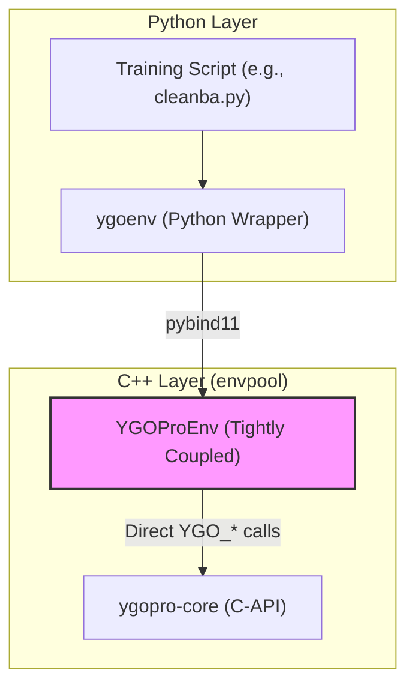
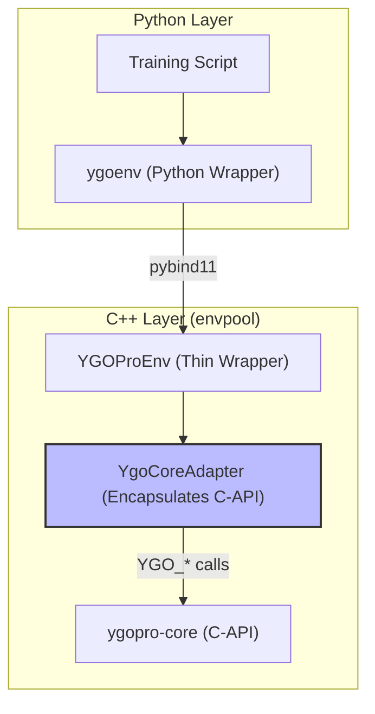
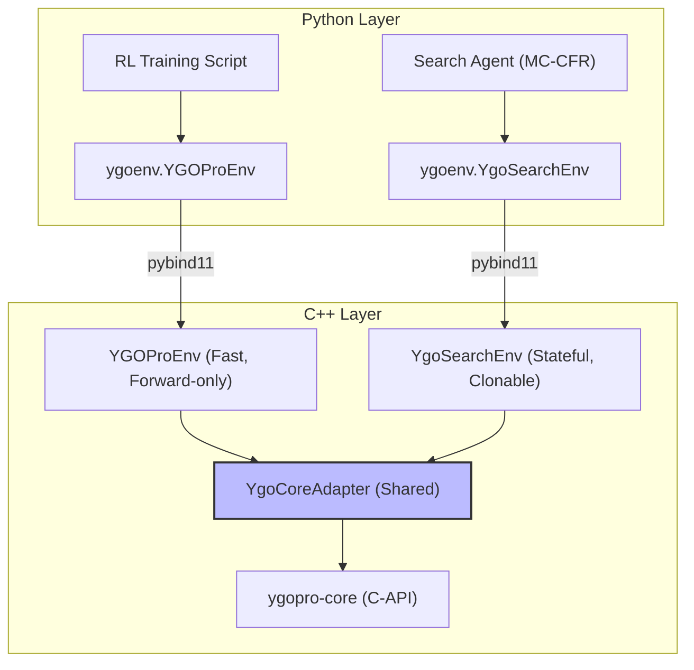

### **Migration Plan: Non-Breaking Refactor of the C++ Environment**

**Overarching Principle:** This refactoring is designed to be **non-breaking at every step.** The existing `YGOProEnv` will remain fully functional throughout the process. We will build the new `YgoCoreAdapter` in parallel, and only at the final step will `YGOProEnv` be modified to use it.

**High-Level Goal:** To create and validate a `YgoCoreAdapter` class that fully encapsulates all interactions with the `ygopro-core` C-API, paving the way for future extensions without disrupting the current RL pipeline.

---

### **North Star Architecture**

This refactor is the foundational step towards a more flexible and extensible simulation environment. The ultimate goal is to support not only fast, forward-only reinforcement learning, but also more complex, search-based algorithms like Monte Carlo Counterfactual Regret Minimization (MC-CFR), which require the ability to save, load, and clone game states.

#### **Current Architecture**

The current system is tightly coupled. The `YGOProEnv` class directly handles all communication with the `ygopro-core` C-API, mixing low-level API calls with environment logic. This makes it difficult to reuse the core simulation logic for different purposes.



#### **Target Architecture (After This Refactor)**

This plan will introduce a `YgoCoreAdapter` that encapsulates all direct interactions with the C-API. `YGOProEnv` will become a thin wrapper, delegating all core simulation tasks to the adapter. This decouples the environment logic from the engine interaction.



#### **Future Vision**

With the adapter in place, we can easily create new types of environments. For example, a `YgoSearchEnv` could be developed to expose state cloning and restoration features for search algorithms, all while reusing the same robust `YgoCoreAdapter` to communicate with the game engine.



For a detailed, function-by-function breakdown of how `YGOProEnv` will be refactored, please see the appendix to this plan:
**[Appendix: `YGOProEnv` to `YgoCoreAdapter` Refactor Plan](./v1.3.0_appendix_ygopro_refactor.md)**

---

### **Milestone 1: Create and Build the Parallel Adapter Skeleton**

**Goal:** To introduce the `YgoCoreAdapter` class and its files. Crucially, we will also add a `pduel_` member to the adapter but **will not** give it ownership yet. This allows us to build the adapter's methods using a raw `pduel` pointer passed from `YGOProEnv`, without changing `YGOProEnv`'s ownership or behavior.

#### **Diagrams: Milestone 1**

| Current State (Unchanged)                                                                                             | Target State (Parallel Construction)                                                                                                                                     |
| :----------------------------------------------------------------------------------------------------------------- | :------------------------------------------------------------------------------------------------------------------------------------------------------- |
| `YGOProEnv` owns `pduel` and makes all `YGO_*` calls.                                                               | `YGOProEnv` still owns `pduel`. A new, unused `YgoCoreAdapter` class is created. We will pass `pduel` to it in later milestones to test its methods. |
| <pre lang="mermaid">graph TD; A["YGOProEnv (owns pduel_)"] -- "YGO_*" --> B["ygopro-core API"];</pre> | <pre lang="mermaid">graph TD; A["YGOProEnv (owns pduel_)"] -- "YGO_*" --> B["ygopro-core API"]; C["YgoCoreAdapter (empty)"]:::dead; style C fill:#eee,stroke:#999,stroke-dasharray: 5 5;</pre> |

#### **Instructions: Milestone 1**

*   **Step 1.1: File Creation**
    *   In `ygoenv/ygoenv/ygopro/` directory, create two new files: `ygo_core_adapter.h` and `ygo_core_adapter.cpp`.

*   **Step 1.2: Define the Adapter Header (`ygo_core_adapter.h`)**
    *   **Instruction:** Define the `YgoCoreAdapter` class with an empty constructor/destructor and a public member for the non-owning `pduel` pointer.
    *   **Code:**
        ```cpp
        // ygoenv/ygoenv/ygopro/ygo_core_adapter.h
        #ifndef YGOENV_YGOPRO_YGO_CORE_ADAPTER_H_
        #define YGOENV_YGOPRO_YGO_CORE_ADAPTER_H_
        #include <cstdint>

        namespace ygopro {
        
        class YgoCoreAdapter {
         public:
          YgoCoreAdapter();
          ~YgoCoreAdapter();

          // This is a non-owning pointer. 
          // YGOProEnv will set this for the adapter's methods to use.
          intptr_t pduel_ = 0; 
        };
        
        }  // namespace ygopro
        
        #endif  // YGOENV_YGOPRO_YGO_CORE_ADAPTER_H_
        ```

*   **Step 1.3: Define the Adapter Source (`ygo_core_adapter.cpp`)**
    *   **Instruction:** Provide the empty implementations and include the adapter header.
    *   **Code:**
        ```cpp
        // ygoenv/ygoenv/ygopro/ygo_core_adapter.cpp
        #include "ygoenv/ygopro/ygo_core_adapter.h"
        
        namespace ygopro {
        
        YgoCoreAdapter::YgoCoreAdapter() {}
        
        YgoCoreAdapter::~YgoCoreAdapter() {}
        
        }  // namespace ygopro
        ```

*   **Step 1.4: Integrate the Adapter into `YGOProEnv` (Non-Functionally)**
    *   **Instruction:** Modify `ygopro.h` to include the new adapter and add it as a member variable. We will also add a line in `YGOProEnv::new_duel` to set the adapter's raw pointer, which is critical for testing in later steps.
    *   **Code (`ygopro.h`):**
        ```cpp
        // In ygoenv/ygoenv/ygopro/ygopro.h

        // Just after the other includes:
        #include "ygoenv/ygopro/ygo_core_adapter.h" // <-- Add this

        // ...
        class YGOProEnv : public Env<YGOProEnvSpec> {
            // ... after other member variables
            std::unique_ptr<YgoCoreAdapter> adapter_; // <-- Add this

            // In YGOProEnv::new_duel(uint32_t seed) method, after pduel is created:
            // ...
            // pduel = YGO_CreateDuel(seed); // This line still exists
            // if (pduel) {
            //     adapter_ = std::make_unique<YgoCoreAdapter>();
            //     adapter_->pduel_ = pduel; // <-- Add this line
            // }
        };
        ```

*   **Step 1.5: Compile & Verify**
    *   **Instruction (Verification Protocol):** All the following commands must be executed from the **workspace root** within the `ygo-agent` conda environment.
        ```bash
        conda activate ygo-agent
        ```
    *   **Instruction (Compile):** Build the C++ code.
        ```bash
        xmake b ygopro_ygoenv
        ```
    *   **Instruction (Reinstall):** Reinstall the `ygoenv` package to link the new C++ build.
        ```bash
        pip install -e ygoenv/
        ```
    *   **Instruction (Verify):** Run a short benchmark evaluation against a random opponent. This command does not require a model checkpoint.
        ```bash
        python -u scripts/eval.py --deck assets/deck/ --num_episodes 20 --strategy random --num_envs 2
        ```
    *   **Expected Outcome:** The system must compile, reinstall, and run with **absolutely no change in behavior**. The evaluation script must complete successfully.

---

### **Milestone 2: Duplicate Engine Logic into the Adapter**

**Goal:** To copy all `YGO_*` C-API calls and their surrounding logic from `YGOProEnv` into new, corresponding methods in `YgoCoreAdapter`. The adapter will remain unused by the live code, but it will become functionally complete.

#### **Diagrams: Milestone 2**

| Current State (Unchanged)                                                                                             | Target State (Parallel Construction)                                                                                                                                     |
| :----------------------------------------------------------------------------------------------------------------- | :------------------------------------------------------------------------------------------------------------------------------------------------------- |
| `YGOProEnv` contains all the logic for calling `YGO_*` functions. | `YgoCoreAdapter` now has a full set of methods (`set_player_info`, `process`, etc.) that are direct copies of the logic from `YGOProEnv`. `YGOProEnv` is still unchanged and uses its own logic. |
| <pre lang="mermaid">graph TD; A["YGOProEnv (methods use YGO_*)"] -- "YGO_*" --> B["C-API"]; C["Adapter (empty)"] --x D;</pre> | <pre lang="mermaid">graph TD; A["YGOProEnv (methods use YGO_*)"] -- "YGO_*" --> B["C-API"]; C["Adapter (methods ALSO use YGO_*)"] -- "YGO_*" --> B; A-.->C;</pre> |

#### **Instructions: Milestone 2**

This is a mechanical process of copying code to populate the adapter's methods.

*   **Step 2.1: Duplicate Setup Logic**
    *   **Instruction:** Create new methods in `YgoCoreAdapter` that mirror the setup logic in `YGOProEnv::new_duel`.
    *   **Code (`ygo_core_adapter.h`):**
        ```cpp
        // Add public methods to YgoCoreAdapter class
        void set_player_info(int32_t playerid, int32_t lp, int32_t startcount, int32_t drawcount);
        void add_card(uint32_t cardcode, uint8_t owner, uint8_t playerid, uint8_t location, uint8_t sequence, uint8_t position);
        void start_duel(int32_t options);
        ```
    *   **Code (`ygo_core_adapter.cpp`):**
        ```cpp
        // Include the ocgapi header
        #include "ygopro-core/ocgapi.h"

        // Implement the new methods by copying logic from YGOProEnv::new_duel
        void YgoCoreAdapter::set_player_info(...) {
            YGO_SetPlayerInfo(pduel_, ...); // Uses the adapter's pduel_ member
        }
        void YgoCoreAdapter::add_card(...) {
            YGO_NewCard(pduel_, ...);
        }
        void YgoCoreAdapter::start_duel(...) {
            YGO_StartDuel(pduel_, ...);
        }
        ```

*   **Step 2.2: Duplicate Core Processing Logic**
    *   **Instruction:** Create new methods in `YgoCoreAdapter` that mirror the core game loop functions.
    *   **Code (`ygo_core_adapter.h`):**
        ```cpp
        // Add public methods to YgoCoreAdapter class
        uint32_t process();
        int32_t get_message(byte* buf);
        void set_response(int32_t value);
        void set_response(const std::vector<byte>& buf);
        ```
    *   **Code (`ygo_core_adapter.cpp`):**
        ```cpp
        // Implement the new methods by copying logic from YGOProEnv
        uint32_t YgoCoreAdapter::process() {
            return YGO_Process(pduel_);
        }
        // ...and so on for get_message, set_response, etc.
        ```

*   **Step 2.3: Duplicate State Querying Logic**
    *   **Instruction:** Create new methods in `YgoCoreAdapter` that mirror the `YGO_Query*` calls and their associated parsing logic. These methods should return clean C++ structs.
    *   **Code (`ygo_data_types.h` - New File):**
        ```cpp
        struct CardInfo { /* ... fields ... */ };
        ```
    *   **Code (`ygo_core_adapter.h`):**
        ```cpp
        // Add public methods to YgoCoreAdapter class
        std::vector<CardInfo> get_field_cards(uint8_t playerid, uint8_t location);
        // ... other query methods
        ```
    *   **Code (`ygo_core_adapter.cpp`):**
        ```cpp
        // Implement the new query methods
        std::vector<CardInfo> YgoCoreAdapter::get_field_cards(...) {
            // Copy the YGO_QueryFieldCard call from YGOProEnv here
            // Copy the byte-parsing loop from YGOProEnv here
            // Populate and return a std::vector<CardInfo>
        }
        ```

*   **Step 2.4: Compile & Verify**
    *   **Instruction (Verification Protocol):** All the following commands must be executed from the **workspace root** within the `ygo-agent` conda environment.
        ```bash
        conda activate ygo-agent
        ```
    *   **Instruction (Compile):** Build the C++ code.
        ```bash
        xmake b ygopro_ygoenv
        ```
    *   **Instruction (Reinstall):** Reinstall the `ygoenv` package to link the new C++ build.
        ```bash
        pip install -e ygoenv/
        ```
    *   **Instruction (Verify):** Run a short benchmark evaluation against a random opponent.
        ```bash
        python -u scripts/eval.py --deck assets/deck/ --num_episodes 20 --strategy random --num_envs 2
        ```
    *   **Expected Outcome:** The system must compile, reinstall, and run with **absolutely no change in behavior**. The evaluation script must complete successfully.

---

### **Milestone 3: Transfer Ownership and Finalize the Adapter**

**Goal:** To transfer ownership of the `pduel` from `YGOProEnv` to `YgoCoreAdapter`. The adapter will now be responsible for creating and destroying the duel object.

#### **Diagrams: Milestone 3**

| Current State (Before) | Target State (After) |
| :--- | :--- |
| `YGOProEnv` creates `pduel` and passes a raw pointer to the adapter. | `YgoCoreAdapter`'s constructor creates `pduel` and its destructor destroys it. `YGOProEnv` just creates the adapter. |
| <pre lang="mermaid">graph LR; A["YGOProEnv"] -- "owns" --> B["pduel"]; A -- "sets ptr" --> C["Adapter"];</pre> | <pre lang="mermaid">graph LR; A["YGOProEnv"] -- "owns" --> C["Adapter"]; C -- "owns" --> B["pduel"];</pre>|

#### **Instructions: Milestone 3**

*   **Step 3.1: Update the Adapter**
    *   **Instruction:** Change the `YgoCoreAdapter` constructor to accept a `seed` and create the `pduel`. Change the destructor to destroy it. This makes the adapter self-sufficient.
    *   **Code (`ygo_core_adapter.h`):**
        ```cpp
        // Change constructor, make pduel_ private
        explicit YgoCoreAdapter(uint32_t seed);
        private:
            intptr_t pduel_;
        ```
    *   **Code (`ygo_core_adapter.cpp`):**
        ```cpp
        // In the constructor:
        YgoCoreAdapter::YgoCoreAdapter(uint32_t seed) {
            std::mt19937 rnd(seed);
            rnd(); // burn 1
            pduel_ = YGO_CreateDuel(rnd());
            if (!pduel_) { /* throw error */ }
        }

        // In the destructor:
        YgoCoreAdapter::~YgoCoreAdapter() {
            if (pduel_) { YGO_EndDuel(pduel_); }
        }
        ```

*   **Step 3.2: Compile & Verify**
    *   **Instruction (Verification Protocol):** All the following commands must be executed from the **workspace root** within the `ygo-agent` conda environment.
        ```bash
        conda activate ygo-agent
        ```
    *   **Instruction (Compile):** Build the C++ code.
        ```bash
        xmake b ygopro_ygoenv
        ```
    *   **Instruction (Reinstall):** Reinstall the `ygoenv` package. This is to ensure the build process is still sound, even though we won't run the Python scripts in this step.
        ```bash
        pip install -e ygoenv/
        ```
    *   **Instruction (Verify):** Do not run the Python scripts.
    *   **Expected Outcome:** The build and reinstall should succeed. This confirms the adapter is now a self-contained component, ready for use.

---

### **Milestone 4: The Atomic Switch**

**Goal:** In one single set of changes, gut all duplicated `YGO_*` logic from `YGOProEnv` and replace it with delegate calls to the fully-functional `YgoCoreAdapter`.

#### **Diagrams: Milestone 4**

| Current State (Before) | Target State (After) |
| :--- | :--- |
| `YGOProEnv` contains duplicated logic, but it is the active path. The adapter is unused. | `YGOProEnv` is now a thin wrapper. All its methods delegate to the `YgoCoreAdapter`. |
| <pre lang="mermaid">graph TD; A["YGOProEnv"] -- "calls YGO_*" --> C[C-API]; B["Adapter (dead code)"] --x C;</pre> | <pre lang="mermaid">graph TD; A["YGOProEnv"] -- "delegates" --> B["Adapter"]; B -- "calls YGO_*" --> C[C-API];</pre>|

#### **Instructions: Milestone 4**

*   **Step 4.1: Refactor `YGOProEnv::new_duel()`**
    *   **Instruction:** In `YGOProEnv::new_duel()`, delete all the C-API calls (`YGO_CreateDuel`, `YGO_SetPlayerInfo`, etc.) and the `pduel` member variable itself.
    *   **Instruction:** Replace the deleted code with the creation of the adapter, followed by calls to the adapter's new, clean methods.
    *   **Code (`ygopro.h`):**
        ```cpp
        // In YGOProEnv::new_duel()
        adapter_ = std::make_unique<YgoCoreAdapter>(seed);
        adapter_->set_player_info(...);
        // for each card...
        adapter_->add_card(...);
        adapter_->start_duel(...);
        ```

*   **Step 4.2: Refactor the Rest of `YGOProEnv`**
    *   **Instruction:** Go through every other method in `YGOProEnv` (`next`, `handle_message`, query helpers, etc.). Delete the C-API call and any associated parsing logic. Replace it with a single call to the corresponding adapter method.
    *   **Example:**
        *   The block that calls `YGO_QueryFieldCard` and parses the bytes becomes `std::vector<CardInfo> cards = adapter_->get_field_cards(...)`.

*   **Step 4.3: Final Compile & Verification**
    *   **Instruction (Verification Protocol):** All the following commands must be executed from the **workspace root** within the `ygo-agent` conda environment.
        ```bash
        conda activate ygo-agent
        ```
    *   **Instruction (Compile):** Build the C++ code.
        ```bash
        xmake b ygopro_ygoenv
        ```
    *   **Instruction (Reinstall):** Reinstall the `ygoenv` package to link the final C++ changes.
        ```bash
        pip install -e ygoenv/
        ```
    *   **Instruction (Verify):** Run the benchmark evaluation to ensure the system is now functioning correctly through the adapter.
        ```bash
        python -u scripts/eval.py --deck assets/deck/ --num_episodes 20 --strategy random --num_envs 2
        ```
    *   **Expected Outcome:** The system must compile, reinstall, and run with **absolutely no change in behavior**. The evaluation script must complete successfully.