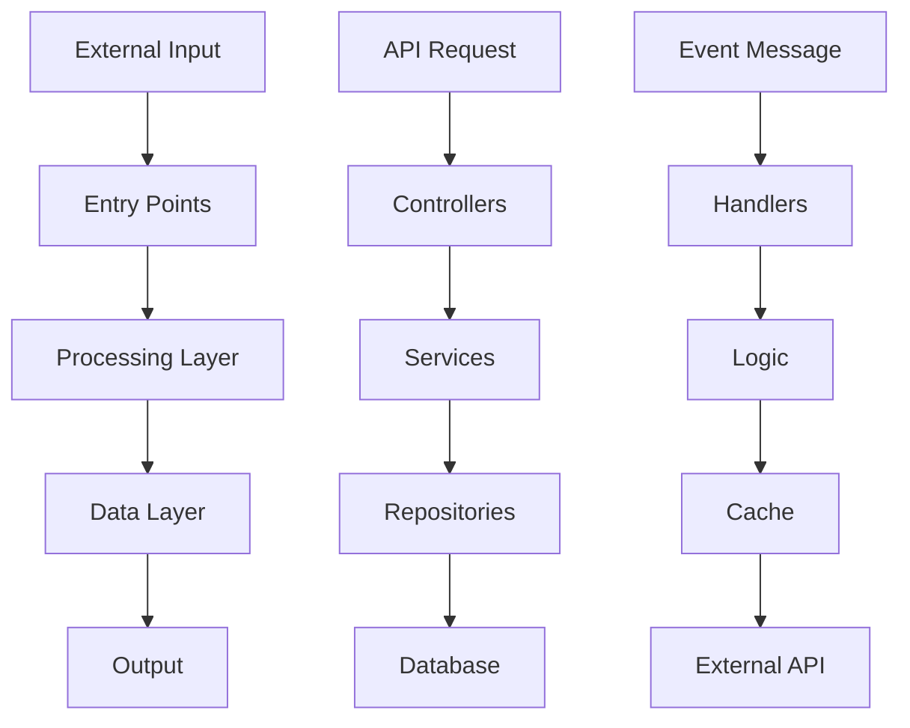

### Step 1.1: File-Level Analysis

For EVERY source file in the primary programming language(s):

Create: [same_directory]/CONTEXT.md with this exact structure if it does not exist. If it does, append the the new file to the context document. This schema as follows should followed exactly, organising by file first.

# [DIRECTORY] Context Documentation

## [FILE-NAME] File

### Purpose Statement
[1-2 sentences: What does this file exist to accomplish?]

### Core Abstractions
[Identify and document the 3-7 most important abstractions in this file using the detailed analysis below]

#### Functions/Methods
For each significant function (>5 lines or business logic):
- **Name**: `[function_name]`
- **Purpose**: [What business problem does this solve?]
- **Input Schema**:

Parameter 1: [type/format] - [Description and constraints]
Parameter 2: [type/format] - [Description and constraints]
Options (optional):
- setting1: [type/format] - [Purpose]
- setting2: [type/format] - [Purpose]

- **Output Schema**:

Return Value: [type/format] - [Main return description]
Additional Info: [type/format] - [Secondary return data]
Error Conditions: [error types] - [When/why errors occur]

- **Side Effects**: [Database writes, API calls, file system changes, state mutations]
- **Error Conditions**: [What can go wrong and how it's handled]
- **Business Rules**: [Validation logic, constraints, calculations performed - or technical rules if business context unavailable]
- **Performance Notes**: [Time complexity, bottlenecks, optimization opportunities]

#### Classes/Objects
For each class or major object:
- **Name**: `[ClassName]`
- **Responsibility**: [Single responsibility this class handles]
- **State Schema**:

Property 1: [type/format] - [Purpose and constraints]
Property 2: [type/format] - [Purpose and constraints]
Computed Values: [type/format] - [How derived]

- **Public Interface**:

method1([parameters]) -> [return_type] - [Purpose]
method2([parameters]) -> [return_type] - [Purpose]
property3 (getter): [type] - [Purpose]
property4 (setter): [type] - [Purpose]

- **Lifecycle**: [Creation → Usage → Cleanup patterns]
- **Dependencies**: [What this class requires to function]
- **Usage Patterns**: [How this is typically instantiated and used]

#### Data Structures/Types
For each important data structure:
- **Name**: `[TypeName]`
- **Purpose**: [What domain concept this represents]
- **Schema Definition**:

Structure: [StructureName]

Required Fields:
- id: [string/identifier] - [Unique identifier format]
- name: [string] - [Display name constraints]
- status: [enum: active|inactive] - [Status values and meanings]

Optional Fields:
- metadata: [nested structure] - [Additional data]
- createdAt: [datetime] - [Creation timestamp]
- updatedAt: [datetime] - [Last modified]
- tags: [list of strings] - [Classification tags]

Computed/Derived Fields:
- displayName: [string] - [How calculated from other fields]
- isValid: [boolean] - [Validation logic applied]

- **Validation Rules**: [Required fields, format constraints, business rules]
- **Transformation Patterns**: [How this converts to/from other formats]
- **Persistence**: [How this is stored - database table, file format, etc.]

#### API Endpoints/Routes
For each API endpoint:
- **Endpoint**: `[METHOD] /path/to/endpoint`
- **Purpose**: [What business operation this performs]
- **Authentication**: [Required permissions, token types]
- **Request Schema**:

HTTP Method: [GET|POST|PUT|DELETE] /path/to/endpoint

Path Parameters:
- id: [string] - [Identifier format/constraints]

Query Parameters:
- limit: [integer] - [Default value, min/max constraints]
- offset: [integer] - [Default value, pagination logic]
- filter: [string] - [Format requirements, filter syntax]

Request Body:
- field1: [type] - [Validation rules and constraints]
- field2: [type] - [Validation rules and constraints]
- nested_object (optional):
- subfield: [type] - [Purpose and validation]

Headers:
- Content-Type: [required content type]
- Authorization: [auth scheme - Bearer token, API key, etc.]

- **Response Schema**:

Success Response (200):
- data: [ResultType] - [Main response data]
- metadata:
- total: [integer] - [Total available records]
- page: [integer] - [Current page number]
- hasMore: [boolean] - [Pagination indicator]

Error Responses:
- 400: [validation error format] - [Invalid request data]
- 401: [auth error format] - [Authentication required]
- 404: [not found format] - [Resource not found]
- 500: [server error format] - [Internal server error]

- **Business Logic**: [What business rules are enforced]
- **Side Effects**: [Database changes, external API calls, events triggered]
- **Performance**: [Typical response time, rate limits, caching]

#### Service/Module Interfaces
For each service or module boundary:
- **Service Name**: `[ServiceName]`
- **Domain Responsibility**: [What business domain this handles]
- **Public Interface**:

```typescript
interface ServiceName {
  // Core operations
  create(input: CreateInput): Promise<Entity>,
  update(id: string, input: UpdateInput): Promise<Entity>,
  delete(id: string): Promise<void>,
  findById(id: string): Promise<Entity | null>,
  findMany(filter: FilterInput): Promise<Entity[]>,

  // Business operations
  performBusinessAction(params: ActionParams): Promise<ActionResult>
}
```

- **Dependencies**: [External services, databases, config required]
- **Configuration**:

	```
	{  databaseUrl: string,  apiKey: string,  timeoutMs: number,  retryAttempts: number}
	```

- **Error Handling**: [How errors are classified and handled]
- **Monitoring**: [Key metrics, health checks, alerts]

#### Data Layer Abstractions

For database models, repositories, or data access:

- **Entity Name**: `[EntityName]`
- **Database Schema**:

- **Repository Interface**:
    
    ```
    Repository: [EntityRepository]Basic Operations:  - save(entity: [EntityType]) -> [EntityType]  - findById(id: [identifier]) -> [EntityType or null/none]  - findByFilter(filter: [FilterType]) -> [list of EntityType]  - update(id: [identifier], changes: [partial EntityType]) -> [EntityType]  - delete(id: [identifier]) -> [success_indicator]
    
    ```
    
- **Query Patterns**: [Common queries and their performance characteristics]
- **Relationships**: [Foreign keys, joins, cascading behavior]
- **Migrations**: [How schema changes are handled]

	```
	Entity: [entity_name]Fields:  - id: [primary_key] - [Auto-generated identifier]  - field1: [string, max_length=255, required] - [Purpose]  - field2: [integer, default=0] - [Purpose]  - created_at: [timestamp, auto=true] - [Creation time]  - updated_at: [timestamp, auto_update=true] - [Last modified]Indexes:  - field1: [standard_index] - [For lookup performance]  - created_at: [standard_index] - [For date-based queries]Relationships:  - belongs_to: [other_entity] via [foreign_key]  - has_many: [related_entities] via [foreign_key]
	```

#### Integration/External System Interfaces

For external API integrations:

- **System Name**: `[ExternalSystemName]`
- **Purpose**: [What business capability this provides]
- **Protocol**: [REST, GraphQL, WebSocket, Message Queue, etc.]
- **Authentication**: [API keys, OAuth, certificates]
- **Request/Response Examples**:
    
    ```
    Outbound Request:POST /external/api/endpoint{  "externalId": "[string format]",  "data": {    "field1": "[value format]",    "field2": "[numeric format]"  }}Expected Response:{  "result": {    "id": "[external identifier format]",    "status": "[processed|pending|failed]",    "data": "[ProcessedDataType structure]"  }}
    
    ```
    
- **Error Handling**: [Retry logic, fallback behavior, error mapping]
- **Rate Limits**: [Request limits, backoff strategies]
- **Data Mapping**: [How internal data maps to external formats]

#### Business Logic/Workflow Abstractions

For complex business processes (if determinable):

- **Workflow Name**: `[WorkflowName]`
- **Business Purpose**: [What business outcome this achieves]
- **Process Steps**:
    
    ```
    1. Input Validation   ├── Check required fields   ├── Validate business rules   └── Authorize user permissions2. Core Processing   ├── Load related data   ├── Apply business logic   ├── Calculate derived values   └── Validate results3. Persistence & Effects   ├── Save to database   ├── Send notifications   ├── Trigger downstream processes   └── Log audit trail
    
    ```
    
- **Decision Points**: [Key branching logic and criteria]
- **Rollback/Compensation**: [How to undo if something fails]
- **Business Rules**: [Constraints, validations, calculations]
- **State Transitions**: [How entity states change through the process]

### Dependencies Map

#### Imports Analysis

Internal Dependencies:
- ServiceA from ./services/serviceA - [Purpose: why needed]
- TypeB from ../types/typeB - [Purpose: why needed]
- UtilC from ../../utils/utilC - [Purpose: why needed]

External Dependencies:
- http_client_library - [Purpose: HTTP client for external APIs]
- validation_library - [Purpose: Runtime type validation]
- data_manipulation_library - [Purpose: Data transformation utilities]

#### Exports Analysis

What this file exposes and why:
- MainClass - [Primary abstraction for specific purpose]
- HelperFunction - [Utility for specific use case]
- TypeDefinition - [Schema for data structure]
- CONFIG - [Configuration for system behavior]

### Integration Points

- **Called by**: [Which files/modules use this and in what contexts]
- **Calls**: [Which files/modules this uses and for what purposes]
- **Data dependencies**: [External data sources, APIs, databases this connects to]
- **Event producers**: [What events/notifications this generates]
- **Event consumers**: [What events this responds to]

### Complexity Indicators

- **Cognitive load**: [High/Medium/Low] - [Reasoning: complexity factors]
- **Change frequency**: [How often this file changes and why]
- **Test coverage**: [Estimated coverage and critical untested paths]
- **Performance sensitivity**: [Whether performance is critical here]
- **Error impact**: [Blast radius if this component fails]

### Step 2.1: Directory Context Creation

Within `/[directory]/CONTEXT.md` append the module level context:

# [Directory Name] Module Context

## Module Purpose
[What unified business purpose do the files in this directory serve?]

## Architecture Pattern
[What design pattern does this module follow? MVC, Repository, Factory, Hexagonal, etc.]

## Key Components Synthesis
### Core Abstractions
[Synthesized from individual CONTEXT.md files - what are the 3-7 most important abstractions across all files?]

### Module Interface
[What does this module expose to the rest of the system?]

```
Module: [ModuleName]

Core Services:

- serviceA: [ServiceAInterface] - [Primary service responsibility]
- serviceB: [ServiceBInterface] - [Secondary service responsibility]

Data Types:

- EntityType: [structure] - [Business entity representation]
- RequestType: [structure] - [Input data format]
- ResponseType: [structure] - [Output data format]

Configuration:

- module_config: [ConfigType] - [Module configuration options]

Utilities:

- helperFunction: [function signature] - [Utility purpose]
- validationFunction: [function signature] - [Validation purpose]
```

### Data Flow Architecture
[How does information move through this directory?]

**Text Description:**

```
External Input → [Entry Points] → [Processing Layer] → [Data Layer] → [Output]
↓              ↓                     ↓               ↓            ↓
API Request → Controllers → Services → Repositories → Database
Event Msg   → Handlers    → Logic    → Cache       → External API
```

**Visual Flow (when helpful):**


## Dependency Analysis

### Internal Dependencies

[What other modules in this codebase does this depend on and why?]

- **Module X**: [Specific services used and for what purpose]
- **Module Y**: [Specific types/interfaces imported and why]

### External Dependencies

[What third-party libraries does this module use and why?]

- **Library A**: [Specific functionality used and business justification]
- **Library B**: [Version constraints and integration patterns]

### Dependents

[What other modules depend on this one and how?]

- **Module Z**: [Uses our services for specific business operations]

## Business Context

### Domain Responsibilities

[If available: What business domain does this module handle? What business rules are centralized here? If unknown: What technical domain or system capability does this module provide?]

### Key Processes

[If available: What end-to-end business processes involve this module? If unknown: What technical processes or workflows does this module support?]

1. **Process A**: [Module's role in this process]
2. **Process B**: [Module's role in this process]

### Critical Rules/Logic

[If available: Critical business logic encoded in this module. If unknown: Critical technical rules, algorithms, or constraints]

- **Rule 1**: [Description and where it's implemented]
- **Rule 2**: [Description and where it's implemented]

## Operational Characteristics

### Performance Profile

[Based on file analysis - what are the performance characteristics?]

- **Throughput**: [Requests per second, processing capacity]
- **Latency**: [Response times for different operations]
- **Resource usage**: [Memory, CPU, I/O patterns]
- **Bottlenecks**: [Known performance limitations]

### Error Handling Strategy

[How does this module handle and propagate errors?]

- **Error classification**: [How errors are categorized]
- **Retry policies**: [What gets retried and how]
- **Fallback behavior**: [What happens when things fail]
- **Error propagation**: [How errors are communicated upstream]

### Monitoring and Observability

[What should be monitored in production?]

- **Key metrics**: [Business and technical metrics to track]
- **Health checks**: [How to verify module is working]
- **Alerts**: [What conditions should trigger alerts]
- **Logging**: [What events are logged and at what level]

## Development Guidance

### Common Development Tasks

[Based on file analysis - what do developers typically do here?]

### Adding New Features

- **New [feature type]**:
    1. Start at: `/[file]` - [reason]
    2. Modify: [specific functions/classes]
    3. Add tests: [testing strategy]
    4. Update: [documentation/config to change]

### Debugging Issues

- **[Issue type] problems**:
    1. Check: `/[file]` → [specific function] - [why this is the entry point]
    2. Trace: [data flow to follow through the module]
    3. Validate: [verification points and data to check]
    4. Common causes: [typical root causes and solutions]

### Performance Optimization

- **[Performance area]**:
    1. Profile: [measurement points and tools]
    2. Bottlenecks: [common bottleneck locations]
    3. Optimization: [proven optimization techniques]
    4. Validation: [how to verify improvements]

### Testing Strategy

[How to comprehensively test this module]

- **Unit tests**: [What to test at the unit level]
- **Integration tests**: [What integration scenarios to cover]
- **Performance tests**: [What performance scenarios to validate]
- **Error condition tests**: [What failure scenarios to test]

### Future Evolution Patterns

[Based on current patterns and business needs - where is this module likely to change?]

- **Growth areas**: [Features likely to be added]
- **Refactoring candidates**: [Code that may need restructuring]
- **External pressures**: [Business or technical forces driving change]