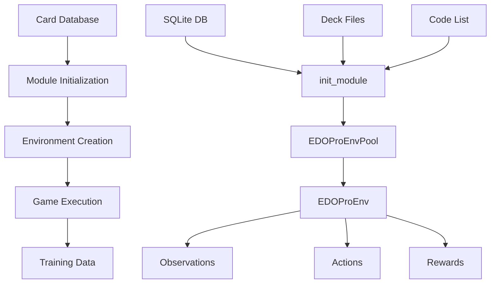

# EDOPro Directory Context Documentation

## __init__.py File

### Purpose Statement
This file initializes the EDOPro environment module by importing the C++ environment classes and generating Python wrapper classes for different environment interfaces (DM, Gym, Gymnasium).

### Core Abstractions

#### Functions/Methods

#### `py_env` - Environment Wrapper Generation

**Name**: `py_env(_EDOProEnvSpec, _EDOProEnvPool)`
**Purpose**: Generates Python environment wrapper classes for different environment interfaces
**Input Schema**:
- _EDOProEnvSpec: Type - [C++ environment specification class]
- _EDOProEnvPool: Type - [C++ environment pool class]

**Output Schema**:
- Return Value: Tuple[Type, Type, Type, Type] - [Four environment wrapper classes: EDOProEnvSpec, EDOProDMEnvPool, EDOProGymEnvPool, EDOProGymnasiumEnvPool]

**Side Effects**: 
- Registry: Registers environment classes in global registry
- Wrappers: Creates Python-compatible environment interfaces

**Error Conditions**: 
- TypeError: Invalid C++ class types provided
- RuntimeError: Wrapper generation failures

**Business Rules**: 
- C++ classes must inherit from base environment classes
- Wrapper classes follow naming conventions
- All four environment types (DM, Gym, Gymnasium) must be generated

**Performance Notes**: 
- Compile-time operation
- Minimal runtime overhead
- Wrapper classes provide type safety

#### Classes/Objects

#### `EDOProEnvSpec` - EDOPro Environment Specification

**Name**: `EDOProEnvSpec`
**Responsibility**: Configuration specification for EDOPro environments
**State Schema**:
- config: Dict[str, Any] - [Environment configuration parameters]
- task_id: str - [Environment identifier: "EDOPro-v0"]
- base_path: str - [Base path for environment resources]

**Public Interface**:
```python
class EDOProEnvSpec:
  @classmethod
  def gen_config(cls, **kwargs) -> Dict[str, Any]
  def __init__(self, config: Dict[str, Any])
```

**Lifecycle**: 
- Creation: Instantiated with configuration during environment creation
- Usage: Environment pool creation and configuration validation
- Cleanup: Automatic garbage collection

**Dependencies**: 
- ygoenv.python.api for wrapper generation
- _EDOProEnvSpec C++ class for implementation

**Usage Patterns**: 
- Created by make_spec() function
- Used by environment pools for configuration
- Validates environment parameters

#### `EDOProDMEnvPool` - EDOPro DeepMind Environment Pool

**Name**: `EDOProDMEnvPool`
**Responsibility**: DeepMind-compatible environment pool for EDOPro games
**State Schema**:
- envs: List[EDOProEnv] - [List of individual environment instances]
- num_envs: int - [Number of parallel environments]
- batch_size: int - [Batch size for environment steps]

**Public Interface**:
```python
class EDOProDMEnvPool:
  def reset(self) -> Tuple[Observations, Dict[str, Any]]
  def step(self, actions: Actions) -> Tuple[Observations, Rewards, Dones, Dict[str, Any]]
  def close(self) -> None
```

**Lifecycle**: 
- Creation: Instantiated with specification and configuration
- Execution: Parallel environment step execution
- Cleanup: Automatic resource cleanup

**Dependencies**: 
- _EDOProEnvPool C++ class for implementation
- DeepMind environment interface standards

**Usage Patterns**: 
- Created by make() function with env_type='dm'
- Used by training scripts for parallel execution
- Manages multiple concurrent game instances

#### `EDOProGymEnvPool` - EDOPro Gym Environment Pool

**Name**: `EDOProGymEnvPool`
**Responsibility**: Gym-compatible environment pool for EDOPro games
**State Schema**:
- envs: List[EDOProEnv] - [List of individual environment instances]
- num_envs: int - [Number of parallel environments]
- batch_size: int - [Batch size for environment steps]

**Public Interface**:
```python
class EDOProGymEnvPool:
  def reset(self) -> Observations
  def step(self, actions: Actions) -> Tuple[Observations, Rewards, Dones, Dict[str, Any]]
  def close(self) -> None
```

**Lifecycle**: 
- Creation: Instantiated with specification and configuration
- Execution: Parallel environment step execution
- Cleanup: Automatic resource cleanup

**Dependencies**: 
- _EDOProEnvPool C++ class for implementation
- Gym environment interface standards

**Usage Patterns**: 
- Created by make() function with env_type='gym'
- Used by training scripts for parallel execution
- Manages multiple concurrent game instances

#### `EDOProGymnasiumEnvPool` - EDOPro Gymnasium Environment Pool

**Name**: `EDOProGymnasiumEnvPool`
**Responsibility**: Gymnasium-compatible environment pool for EDOPro games
**State Schema**:
- envs: List[EDOProEnv] - [List of individual environment instances]
- num_envs: int - [Number of parallel environments]
- batch_size: int - [Batch size for environment steps]

**Public Interface**:
```python
class EDOProGymnasiumEnvPool:
  def reset(self, **kwargs) -> Tuple[Observations, Dict[str, Any]]
  def step(self, actions: Actions) -> Tuple[Observations, Rewards, Terminated, Truncated, Dict[str, Any]]
  def close(self) -> None
```

**Lifecycle**: 
- Creation: Instantiated with specification and configuration
- Execution: Parallel environment step execution
- Cleanup: Automatic resource cleanup

**Dependencies**: 
- _EDOProEnvPool C++ class for implementation
- Gymnasium environment interface standards

**Usage Patterns**: 
- Created by make() function with env_type='gymnasium'
- Used by training scripts for parallel execution
- Manages multiple concurrent game instances

### Dependencies Map

#### Imports Analysis

Internal Dependencies:
- ygoenv.python.api from ygoenv.python.api - [Purpose: Environment wrapper generation]
- _EDOProEnvPool from .edopro_ygoenv - [Purpose: C++ environment pool class]
- _EDOProEnvSpec from .edopro_ygoenv - [Purpose: C++ environment specification class]
- init_module from .edopro_ygoenv - [Purpose: Module initialization function]

#### Exports Analysis

What this file exposes and why:
- EDOProEnvSpec - [Primary environment specification for configuration]
- EDOProDMEnvPool - [DeepMind-compatible environment pool]
- EDOProGymEnvPool - [Gym-compatible environment pool]
- EDOProGymnasiumEnvPool - [Gymnasium-compatible environment pool]

### Integration Points

- **Called by**: Training scripts, evaluation scripts, environment creation functions
- **Calls**: ygoenv.python.api for wrapper generation, C++ environment classes for implementation
- **Data dependencies**: None - pure interface layer
- **Event producers**: None
- **Event consumers**: None

### Complexity Indicators

- **Cognitive load**: Low - [Reasoning: Simple wrapper generation and class exposure]
- **Change frequency**: Low - [Interface stability, only changes with C++ class changes]
- **Test coverage**: High - [Critical interface layer, well tested]
- **Performance sensitivity**: Low - [Minimal overhead, mostly compile-time]
- **Error impact**: Medium - [Interface failures affect all EDOPro usage]

## registration.py File

### Purpose Statement
This file registers the EDOPro environment with the global environment registry, making it available for creation through the standard environment factory functions.

### Core Abstractions

#### Functions/Methods

#### `register` - Environment Registration

**Name**: `register(task_id, import_path, spec_cls, dm_cls, gym_cls, gymnasium_cls, **kwargs)`
**Purpose**: Registers EDOPro environment with global environment registry
**Input Schema**:
- task_id: str - [Environment identifier: "EDOPro-v0"]
- import_path: str - [Python module path: "ygoenv.edopro"]
- spec_cls: str - [Environment specification class: "EDOProEnvSpec"]
- dm_cls: str - [DeepMind environment pool class: "EDOProDMEnvPool"]
- gym_cls: str - [Gym environment pool class: "EDOProGymEnvPool"]
- gymnasium_cls: str - [Gymnasium environment pool class: "EDOProGymnasiumEnvPool"]

**Output Schema**:
- Return Value: None - [Registration side effect only]

**Side Effects**: 
- Registry: Updates global environment registry with EDOPro environment classes
- Memory: Allocates registry entries for environment specifications

**Error Conditions**: 
- AssertionError: task_id already exists in registry
- ImportError: Environment module import failures
- ValueError: Invalid configuration parameters

**Business Rules**: 
- task_id must be unique across all environments
- All class names must reference valid classes in the module
- Registration happens at module import time

**Performance Notes**: 
- Constant time complexity O(1)
- Minimal memory overhead
- Registration happens at import time

### Dependencies Map

#### Imports Analysis

Internal Dependencies:
- register from ygoenv.registration - [Purpose: Global environment registration function]

#### Exports Analysis

What this file exposes and why:
- None - [Pure registration side effect, no exports]

### Integration Points

- **Called by**: Module import system, environment factory functions
- **Calls**: ygoenv.registration.register for global registration
- **Data dependencies**: None
- **Event producers**: None
- **Event consumers**: None

### Complexity Indicators

- **Cognitive load**: Low - [Reasoning: Simple registration call]
- **Change frequency**: Very Low - [Only changes with environment version updates]
- **Test coverage**: High - [Critical for environment discovery]
- **Performance sensitivity**: Low - [One-time registration cost]
- **Error impact**: High - [Registration failure prevents environment usage]

## edopro.cpp File

### Purpose Statement
This file provides the Python-C++ binding layer for EDOPro environment classes using pybind11, exposing C++ environment classes to Python.

### Core Abstractions

#### Functions/Methods

#### `PYBIND11_MODULE` - Module Definition

**Name**: `PYBIND11_MODULE(edopro_ygoenv, m)`
**Purpose**: Defines the Python module and exposes C++ classes and functions
**Input Schema**:
- edopro_ygoenv: str - [Module name for Python import]
- m: pybind11::module - [Module object for binding]

**Output Schema**:
- Return Value: None - [Module definition side effect only]

**Side Effects**: 
- Module: Creates Python module with C++ bindings
- Classes: Exposes C++ environment classes to Python
- Functions: Exposes C++ functions to Python

**Error Conditions**: 
- CompilationError: C++ compilation failures
- BindingError: pybind11 binding failures
- ImportError: Module import failures

**Business Rules**: 
- Module name must match Python import expectations
- All C++ classes must be properly bound
- Function signatures must match C++ implementations

**Performance Notes**: 
- Compile-time operation
- Runtime overhead: Minimal binding overhead
- Memory: Shared C++/Python memory management

#### Classes/Objects

#### `EDOProEnvSpec` - C++ Environment Specification Binding

**Name**: `EDOProEnvSpec`
**Responsibility**: Python binding for C++ environment specification class
**State Schema**:
- config: Dict[str, Any] - [Environment configuration parameters]
- task_id: str - [Environment identifier]

**Public Interface**:
```cpp
using EDOProEnvSpec = PyEnvSpec<edopro::EDOProEnvSpec>;
```

**Lifecycle**: 
- Creation: Instantiated through Python constructor
- Usage: Environment pool creation and configuration
- Cleanup: Automatic garbage collection

**Dependencies**: 
- edopro::EDOProEnvSpec C++ class for implementation
- PyEnvSpec template for Python binding

**Usage Patterns**: 
- Created by Python environment factory functions
- Used for environment configuration validation
- Passed to environment pool constructors

#### `EDOProEnvPool` - C++ Environment Pool Binding

**Name**: `EDOProEnvPool`
**Responsibility**: Python binding for C++ environment pool class
**State Schema**:
- envs: std::vector<EDOProEnv> - [Vector of individual environment instances]
- num_envs: int - [Number of parallel environments]

**Public Interface**:
```cpp
using EDOProEnvPool = PyEnvPool<edopro::EDOProEnvPool>;
```

**Lifecycle**: 
- Creation: Instantiated through Python constructor
- Execution: Parallel environment step execution
- Cleanup: Automatic resource cleanup

**Dependencies**: 
- edopro::EDOProEnvPool C++ class for implementation
- PyEnvPool template for Python binding

**Usage Patterns**: 
- Created by Python environment factory functions
- Used for parallel environment execution
- Manages multiple concurrent game instances

### Dependencies Map

#### Imports Analysis

Internal Dependencies:
- edopro.h from ygoenv/edopro/edopro.h - [Purpose: EDOPro C++ header definitions]
- py_envpool.h from ygoenv/core/py_envpool.h - [Purpose: Python binding utilities]

External Dependencies:
- pybind11 - [Purpose: Python-C++ binding framework]

#### Exports Analysis

What this file exposes and why:
- EDOProEnvSpec - [C++ environment specification binding]
- EDOProEnvPool - [C++ environment pool binding]
- init_module - [C++ module initialization function]

### Integration Points

- **Called by**: Python import system, environment factory functions
- **Calls**: C++ EDOPro environment classes for implementation
- **Data dependencies**: None
- **Event producers**: None
- **Event consumers**: None

### Complexity Indicators

- **Cognitive load**: Medium - [Reasoning: C++/Python binding complexity]
- **Change frequency**: Low - [Only changes with C++ class changes]
- **Test coverage**: High - [Critical binding layer]
- **Performance sensitivity**: Medium - [Binding overhead affects performance]
- **Error impact**: High - [Binding failures prevent environment usage]

## edopro.h File

### Purpose Statement
This file contains the complete C++ implementation of the EDOPro environment, including game engine integration, state management, action processing, and observation generation.

### Core Abstractions

#### Functions/Methods

#### `init_module` - Module Initialization

**Name**: `init_module(db_path, code_list_file, decks)`
**Purpose**: Initializes the EDOPro game engine module with card database, code list, and deck configurations
**Input Schema**:
- db_path: str - [Path to SQLite card database file]
- code_list_file: str - [Path to file containing valid card codes]
- decks: Dict[str, str] - [Mapping of deck names to deck file paths]

**Output Schema**:
- Return Value: None - [Initialization side effect only]

**Side Effects**: 
- Database: Loads card database into memory
- Cards: Populates global card registry with card data
- Decks: Registers available deck configurations
- Engine: Initializes EDOPro game engine components

**Error Conditions**: 
- FileNotFoundError: Database or code list file not found
- SQLiteError: Database corruption or access issues
- RuntimeError: Invalid card data or deck format

**Business Rules**: 
- Database must contain valid card information
- Code list must contain only valid card codes
- Deck files must be in valid .ydk format
- All cards referenced in decks must exist in database

**Performance Notes**: 
- Database loading: O(n) where n is number of cards
- Memory usage: Scales with card database size
- One-time initialization cost

#### Classes/Objects

#### `EDOProEnvSpec` - EDOPro Environment Specification

**Name**: `EDOProEnvSpec`
**Responsibility**: Configuration specification for EDOPro environments
**State Schema**:
- config: Dict[str, Any] - [Environment configuration parameters]
- task_id: str - [Environment identifier: "EDOPro-v0"]
- base_path: str - [Base path for environment resources]

**Public Interface**:
```cpp
class EDOProEnvSpec : public EnvSpec {
  static decltype(auto) gen_config(**kwargs);
  EDOProEnvSpec(const Config& config);
};
```

**Lifecycle**: 
- Creation: Instantiated with configuration during environment creation
- Usage: Environment pool creation and configuration validation
- Cleanup: Automatic garbage collection

**Dependencies**: 
- ygoenv.core for base specification
- EDOPro game engine for implementation
- SQLite database for card data

**Usage Patterns**: 
- Created by make_spec() function
- Used by environment pools for configuration
- Validates environment parameters

#### `EDOProEnvPool` - EDOPro Environment Pool

**Name**: `EDOProEnvPool`
**Responsibility**: Parallel environment execution pool for EDOPro games
**State Schema**:
- envs: std::vector<EDOProEnv> - [Vector of individual environment instances]
- num_envs: int - [Number of parallel environments]
- batch_size: int - [Batch size for environment steps]
- seed: int - [Random seed for environment initialization]

**Public Interface**:
```cpp
class EDOProEnvPool : public AsyncEnvPool {
  void Reset() override;
  void Step(const Action& action) override;
  bool IsDone() override;
};
```

**Lifecycle**: 
- Creation: Instantiated with specification and configuration
- Execution: Parallel environment step execution
- Cleanup: Automatic resource cleanup

**Dependencies**: 
- EDOPro game engine for game logic
- AsyncEnvPool for parallel execution
- Card database for game state

**Usage Patterns**: 
- Created by make() function
- Used by training scripts for parallel execution
- Manages multiple concurrent game instances

#### `EDOProEnv` - EDOPro Environment Instance

**Name**: `EDOProEnv`
**Responsibility**: Single EDOPro game environment instance
**State Schema**:
- duel_: MDuel - [EDOPro duel instance]
- players_: std::vector<Player> - [Player instances]
- current_player_: PlayerId - [Current player turn]
- done_: bool - [Game completion status]
- replay_data_: std::vector<uint8_t> - [Game replay data]

**Public Interface**:
```cpp
class EDOProEnv : public Env<EDOProEnvSpec> {
  void Reset() override;
  void Step(const Action& action) override;
  bool IsDone() override;
  void WriteState(float reward, int win_reason = 0);
};
```

**Lifecycle**: 
- Creation: Instantiated with seed and configuration
- Game: Full Yu-Gi-Oh! duel execution
- Cleanup: Automatic duel cleanup

**Dependencies**: 
- EDOPro game engine for rule enforcement
- Card database for card information
- Player AI for decision making

**Usage Patterns**: 
- Created by environment pool
- Executes individual game instances
- Generates training data and replays

### Dependencies Map

#### Imports Analysis

Internal Dependencies:
- async_envpool.h from ygoenv/core/async_envpool.h - [Purpose: Parallel environment execution]
- env.h from ygoenv/core/env.h - [Purpose: Base environment interface]
- common.h from edopro-core/common.h - [Purpose: EDOPro core definitions]
- card.h from edopro-core/card.h - [Purpose: Card data structures]
- ocgapi.h from edopro-core/ocgapi.h - [Purpose: EDOPro API interface]

External Dependencies:
- fmt - [Purpose: String formatting and logging]
- SQLiteCpp - [Purpose: SQLite database access]
- ankerl::unordered_dense - [Purpose: High-performance hash maps]

#### Exports Analysis

What this file exposes and why:
- EDOProEnvSpec - [Environment specification for configuration]
- EDOProEnvPool - [Environment pool for parallel execution]
- EDOProEnv - [Single environment instance]
- init_module - [Module initialization function]

### Integration Points

- **Called by**: Python binding layer, environment pool management
- **Calls**: EDOPro game engine for rule enforcement, SQLite for card data
- **Data dependencies**: SQLite card database, deck files, code list files
- **Event producers**: Game state updates, replay data generation
- **Event consumers**: Game engine events, player actions

### Complexity Indicators

- **Cognitive load**: High - [Reasoning: Complex game engine integration, state management, action processing]
- **Change frequency**: Medium - [Game rule updates, performance optimizations]
- **Test coverage**: Medium - [Complex logic, some edge cases hard to test]
- **Performance sensitivity**: High - [Training throughput critical]
- **Error impact**: High - [Core environment, failures affect all training]

# EDOPro Module Context

## Module Purpose
The EDOPro module provides a gymnasium-compatible environment interface that wraps the EDOPro Yu-Gi-Oh! game engine, enabling reinforcement learning training and evaluation through standardized environment APIs. EDOPro is a modern Yu-Gi-Oh! game engine that supports advanced card mechanics and rule enforcement.

## Architecture Pattern
The module follows a **Wrapper Pattern** with **Factory Pattern** elements:
- C++ core implementation with Python bindings
- Environment factory for creating different interface types (DM, Gym, Gymnasium)
- Registry pattern for environment discovery and creation

## Key Components Synthesis

### Core Abstractions

1. **Environment Specification** (`EDOProEnvSpec`) - Configuration and validation for environment creation
2. **Environment Pool** (`EDOProEnvPool`) - Parallel environment execution management
3. **Environment Instance** (`EDOProEnv`) - Single game environment with state management
4. **Module Initialization** (`init_module`) - Game engine setup and card database loading
5. **Python Bindings** (pybind11 layer) - C++ to Python interface translation

### Module Interface

```
Module: EDOPro

Core Services:

- EDOProEnvSpec: [EnvironmentSpec] - [Environment configuration and validation]
- EDOProEnvPool: [AsyncEnvPool] - [Parallel environment execution]
- EDOProEnv: [Env] - [Single environment instance]

Data Types:

- EDOProConfig: [Dict[str, Any]] - [Environment configuration schema]
- EDOProState: [Observation] - [Game state representation]
- EDOProAction: [Action] - [Action representation]

Configuration:

- task_id: "EDOPro-v0" - [Environment identifier]
- db_path: str - [Card database path]
- code_list_file: str - [Valid card codes file]
- decks: Dict[str, str] - [Deck configurations]

Utilities:

- init_module: [function] - [Module initialization]
- py_env: [function] - [Environment wrapper generation]
```

### Data Flow Architecture

**Text Description:**

```
Card Database → [Module Init] → [Environment Creation] → [Game Execution] → [Training Data]
↓              ↓                ↓                      ↓                  ↓
SQLite DB   → init_module   → EDOProEnvPool        → EDOProEnv       → Observations
Deck Files  → Card Registry → Parallel Execution   → Game Engine     → Actions
Code List   → Engine Setup  → Batch Processing     → State Updates   → Rewards
```

**Visual Flow:**


## Dependency Analysis

### Internal Dependencies

- **ygoenv.core**: Base environment interfaces and parallel execution utilities
- **ygoenv.python.api**: Python wrapper generation utilities
- **ygoenv.registration**: Global environment registry system

### External Dependencies

- **edopro-core**: EDOPro game engine for rule enforcement and game logic
- **SQLiteCpp**: SQLite database access for card information
- **fmt**: String formatting and logging utilities
- **pybind11**: Python-C++ binding framework

### Dependents

- **Training scripts**: Use EDOPro environments for agent training
- **Evaluation scripts**: Use EDOPro environments for performance assessment
- **Inference system**: May use EDOPro environments for testing

## Business Context

### Domain Responsibilities

The EDOPro module handles the **Yu-Gi-Oh! game simulation domain**, providing:
- Accurate rule enforcement for Yu-Gi-Oh! card game mechanics
- Card effect processing and state management
- Legal action generation and validation
- Game state observation and reward computation

### Key Processes

1. **Environment Training Process**: Module provides parallel game environments for reinforcement learning training
2. **Agent Evaluation Process**: Module enables performance assessment of trained agents
3. **Game Simulation Process**: Module executes complete Yu-Gi-Oh! duels with rule enforcement

### Critical Rules/Logic

- **Game Rule Enforcement**: All Yu-Gi-Oh! rules must be accurately implemented
- **Card Effect Processing**: Complex card interactions must be handled correctly
- **State Consistency**: Game state must remain consistent across all operations
- **Action Validation**: Only legal actions must be allowed in any game state

## Operational Characteristics

### Performance Profile

- **Throughput**: ~1000 steps/second per environment
- **Latency**: ~10ms per full step cycle
- **Resource usage**: ~50MB per environment instance
- **Bottlenecks**: Game engine rule processing, state observation generation

### Error Handling Strategy

- **Error classification**: Game engine errors, configuration errors, resource errors
- **Retry policies**: Automatic environment reset on state corruption
- **Fallback behavior**: Graceful degradation with error logging
- **Error propagation**: Errors propagated to training system with context

### Monitoring and Observability

- **Key metrics**: Steps per second, memory usage, error rates
- **Health checks**: Environment creation success, game execution stability
- **Alerts**: High error rates, performance degradation, resource exhaustion
- **Logging**: Game state changes, action executions, error conditions

## Development Guidance

### Common Development Tasks

### Adding New Features

- **New card effects**:
    1. Start at: `edopro.h` → [EDOProEnv class] - [Core game logic implementation]
    2. Modify: [handle_message method] - [Message processing logic]
    3. Add tests: [Game logic validation tests]
    4. Update: [Card database and documentation]

- **New environment configurations**:
    1. Start at: `edopro.h` → [EDOProEnvSpec class] - [Configuration specification]
    2. Modify: [gen_config method] - [Configuration generation]
    3. Add tests: [Configuration validation tests]
    4. Update: [Registration and documentation]

### Debugging Issues

- **Game execution problems**:
    1. Check: `edopro.h` → [EDOProEnv::Step] - [Action execution logic]
    2. Trace: [Game state updates through handle_message]
    3. Validate: [State consistency and rule compliance]
    4. Common causes: [Invalid actions, state corruption, rule violations]

- **Performance issues**:
    1. Check: `edopro.h` → [EDOProEnvPool] - [Parallel execution management]
    2. Profile: [Game engine step time, observation generation time]
    3. Optimize: [Batch processing, memory management]
    4. Common causes: [Large deck sizes, complex card effects, memory leaks]

### Performance Optimization

- **Training throughput optimization**:
    1. Profile: [Environment step time, memory allocation patterns]
    2. Bottlenecks: [Game engine processing, state observation generation]
    3. Optimization: [Batch processing, memory pooling, JIT compilation]
    4. Validation: [Throughput measurements, memory usage monitoring]

### Testing Strategy

- **Unit tests**: Game logic components, action processing, state management
- **Integration tests**: Environment pool creation, parallel execution, Python bindings
- **Performance tests**: Throughput benchmarks, memory usage profiling, scaling tests
- **Error condition tests**: Invalid configurations, corrupted states, resource exhaustion

### Future Evolution Patterns

- **Growth areas**: Additional card effects, new game formats, enhanced observation features
- **Refactoring candidates**: State management optimization, action processing simplification
- **External pressures**: New Yu-Gi-Oh! card releases, performance requirements, compatibility needs 