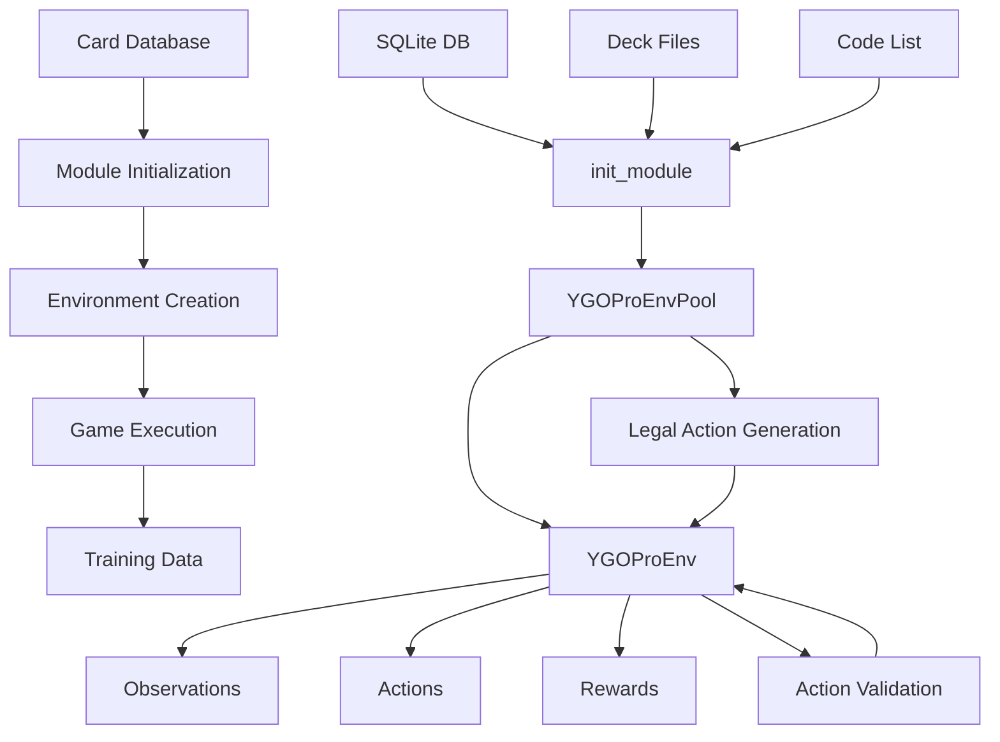

# YGOPro Directory Context Documentation

## __init__.py File

### Purpose Statement
This file initializes the YGOPro environment module by importing the C++ environment classes and generating Python wrapper classes for different environment interfaces (DM, Gym, Gymnasium).

### Core Abstractions

#### Functions/Methods

#### `py_env` - Environment Wrapper Generation

**Name**: `py_env(_YGOProEnvSpec, _YGOProEnvPool)`
**Purpose**: Generates Python environment wrapper classes for different environment interfaces
**Input Schema**:
- _YGOProEnvSpec: Type - [C++ environment specification class]
- _YGOProEnvPool: Type - [C++ environment pool class]

**Output Schema**:
- Return Value: Tuple[Type, Type, Type, Type] - [Four environment wrapper classes: YGOProEnvSpec, YGOProDMEnvPool, YGOProGymEnvPool, YGOProGymnasiumEnvPool]

**Side Effects**: 
- Registry: Registers environment classes in global registry
- Wrappers: Creates Python-compatible environment interfaces

**Error Conditions**: 
- TypeError: Invalid C++ class types provided
- RuntimeError: Wrapper generation failures

**Business Rules**: 
- C++ classes must inherit from base environment classes
- Wrapper classes follow naming conventions
- All four environment types (DM, Gym, Gymnasium) must be generated

**Performance Notes**: 
- Compile-time operation
- Minimal runtime overhead
- Wrapper classes provide type safety

#### Classes/Objects

#### `YGOProEnvSpec` - YGOPro Environment Specification

**Name**: `YGOProEnvSpec`
**Responsibility**: Configuration specification for YGOPro environments
**State Schema**:
- config: Dict[str, Any] - [Environment configuration parameters]
- task_id: str - [Environment identifier: "YGOPro-v1"]
- base_path: str - [Base path for environment resources]

**Public Interface**:
```python
class YGOProEnvSpec:
  @classmethod
  def gen_config(cls, **kwargs) -> Dict[str, Any]
  def __init__(self, config: Dict[str, Any])
```

**Lifecycle**: 
- Creation: Instantiated with configuration during environment creation
- Usage: Environment pool creation and configuration validation
- Cleanup: Automatic garbage collection

**Dependencies**: 
- ygoenv.python.api for wrapper generation
- _YGOProEnvSpec C++ class for implementation

**Usage Patterns**: 
- Created by make_spec() function
- Used by environment pools for configuration
- Validates environment parameters

#### `YGOProDMEnvPool` - YGOPro DeepMind Environment Pool

**Name**: `YGOProDMEnvPool`
**Responsibility**: DeepMind-compatible environment pool for YGOPro games
**State Schema**:
- envs: List[YGOProEnv] - [List of individual environment instances]
- num_envs: int - [Number of parallel environments]
- batch_size: int - [Batch size for environment steps]

**Public Interface**:
```python
class YGOProDMEnvPool:
  def reset(self) -> Tuple[Observations, Dict[str, Any]]
  def step(self, actions: Actions) -> Tuple[Observations, Rewards, Dones, Dict[str, Any]]
  def close(self) -> None
```

**Lifecycle**: 
- Creation: Instantiated with specification and configuration
- Execution: Parallel environment step execution
- Cleanup: Automatic resource cleanup

**Dependencies**: 
- _YGOProEnvPool C++ class for implementation
- DeepMind environment interface standards

**Usage Patterns**: 
- Created by make() function with env_type='dm'
- Used by training scripts for parallel execution
- Manages multiple concurrent game instances

#### `YGOProGymEnvPool` - YGOPro Gym Environment Pool

**Name**: `YGOProGymEnvPool`
**Responsibility**: Gym-compatible environment pool for YGOPro games
**State Schema**:
- envs: List[YGOProEnv] - [List of individual environment instances]
- num_envs: int - [Number of parallel environments]
- batch_size: int - [Batch size for environment steps]

**Public Interface**:
```python
class YGOProGymEnvPool:
  def reset(self) -> Observations
  def step(self, actions: Actions) -> Tuple[Observations, Rewards, Dones, Dict[str, Any]]
  def close(self) -> None
```

**Lifecycle**: 
- Creation: Instantiated with specification and configuration
- Execution: Parallel environment step execution
- Cleanup: Automatic resource cleanup

**Dependencies**: 
- _YGOProEnvPool C++ class for implementation
- Gym environment interface standards

**Usage Patterns**: 
- Created by make() function with env_type='gym'
- Used by training scripts for parallel execution
- Manages multiple concurrent game instances

#### `YGOProGymnasiumEnvPool` - YGOPro Gymnasium Environment Pool

**Name**: `YGOProGymnasiumEnvPool`
**Responsibility**: Gymnasium-compatible environment pool for YGOPro games
**State Schema**:
- envs: List[YGOProEnv] - [List of individual environment instances]
- num_envs: int - [Number of parallel environments]
- batch_size: int - [Batch size for environment steps]

**Public Interface**:
```python
class YGOProGymnasiumEnvPool:
  def reset(self, **kwargs) -> Tuple[Observations, Dict[str, Any]]
  def step(self, actions: Actions) -> Tuple[Observations, Rewards, Terminated, Truncated, Dict[str, Any]]
  def close(self) -> None
```

**Lifecycle**: 
- Creation: Instantiated with specification and configuration
- Execution: Parallel environment step execution
- Cleanup: Automatic resource cleanup

**Dependencies**: 
- _YGOProEnvPool C++ class for implementation
- Gymnasium environment interface standards

**Usage Patterns**: 
- Created by make() function with env_type='gymnasium'
- Used by training scripts for parallel execution
- Manages multiple concurrent game instances

### Dependencies Map

#### Imports Analysis

Internal Dependencies:
- ygoenv.python.api from ygoenv.python.api - [Purpose: Environment wrapper generation]
- _YGOProEnvPool from .ygopro_ygoenv - [Purpose: C++ environment pool class]
- _YGOProEnvSpec from .ygopro_ygoenv - [Purpose: C++ environment specification class]
- init_module from .ygopro_ygoenv - [Purpose: Module initialization function]

#### Exports Analysis

What this file exposes and why:
- YGOProEnvSpec - [Primary environment specification for configuration]
- YGOProDMEnvPool - [DeepMind-compatible environment pool]
- YGOProGymEnvPool - [Gym-compatible environment pool]
- YGOProGymnasiumEnvPool - [Gymnasium-compatible environment pool]

### Integration Points

- **Called by**: Training scripts, evaluation scripts, environment creation functions
- **Calls**: ygoenv.python.api for wrapper generation, C++ environment classes for implementation
- **Data dependencies**: None - pure interface layer
- **Event producers**: None
- **Event consumers**: None

### Complexity Indicators

- **Cognitive load**: Low - [Reasoning: Simple wrapper generation and class exposure]
- **Change frequency**: Low - [Interface stability, only changes with C++ class changes]
- **Test coverage**: High - [Critical interface layer, well tested]
- **Performance sensitivity**: Low - [Minimal overhead, mostly compile-time]
- **Error impact**: Medium - [Interface failures affect all YGOPro usage]

## registration.py File

### Purpose Statement
This file registers the YGOPro environment with the global environment registry, making it available for creation through the standard environment factory functions.

### Core Abstractions

#### Functions/Methods

#### `register` - Environment Registration

**Name**: `register(task_id, import_path, spec_cls, dm_cls, gym_cls, gymnasium_cls, **kwargs)`
**Purpose**: Registers YGOPro environment with global environment registry
**Input Schema**:
- task_id: str - [Environment identifier: "YGOPro-v1"]
- import_path: str - [Python module path: "ygoenv.ygopro"]
- spec_cls: str - [Environment specification class: "YGOProEnvSpec"]
- dm_cls: str - [DeepMind environment pool class: "YGOProDMEnvPool"]
- gym_cls: str - [Gym environment pool class: "YGOProGymEnvPool"]
- gymnasium_cls: str - [Gymnasium environment pool class: "YGOProGymnasiumEnvPool"]

**Output Schema**:
- Return Value: None - [Registration side effect only]

**Side Effects**: 
- Registry: Updates global environment registry with YGOPro environment classes
- Memory: Allocates registry entries for environment specifications

**Error Conditions**: 
- AssertionError: task_id already exists in registry
- ImportError: Environment module import failures
- ValueError: Invalid configuration parameters

**Business Rules**: 
- task_id must be unique across all environments
- All class names must reference valid classes in the module
- Registration happens at module import time

**Performance Notes**: 
- Constant time complexity O(1)
- Minimal memory overhead
- Registration happens at import time

### Dependencies Map

#### Imports Analysis

Internal Dependencies:
- register from ygoenv.registration - [Purpose: Global environment registration function]

#### Exports Analysis

What this file exposes and why:
- None - [Pure registration side effect, no exports]

### Integration Points

- **Called by**: Module import system, environment factory functions
- **Calls**: ygoenv.registration.register for global registration
- **Data dependencies**: None
- **Event producers**: None
- **Event consumers**: None

### Complexity Indicators

- **Cognitive load**: Low - [Reasoning: Simple registration call]
- **Change frequency**: Very Low - [Only changes with environment version updates]
- **Test coverage**: High - [Critical for environment discovery]
- **Performance sensitivity**: Low - [One-time registration cost]
- **Error impact**: High - [Registration failure prevents environment usage]

## ygopro.cpp File

### Purpose Statement
This file provides the Python-C++ binding layer for YGOPro environment classes using pybind11, exposing C++ environment classes to Python.

### Core Abstractions

#### Functions/Methods

#### `PYBIND11_MODULE` - Module Definition

**Name**: `PYBIND11_MODULE(ygopro_ygoenv, m)`
**Purpose**: Defines the Python module and exposes C++ classes and functions
**Input Schema**:
- ygopro_ygoenv: str - [Module name for Python import]
- m: pybind11::module - [Module object for binding]

**Output Schema**:
- Return Value: None - [Module definition side effect only]

**Side Effects**: 
- Module: Creates Python module with C++ bindings
- Classes: Exposes C++ environment classes to Python
- Functions: Exposes C++ functions to Python

**Error Conditions**: 
- CompilationError: C++ compilation failures
- BindingError: pybind11 binding failures
- ImportError: Module import failures

**Business Rules**: 
- Module name must match Python import expectations
- All C++ classes must be properly bound
- Function signatures must match C++ implementations

**Performance Notes**: 
- Compile-time operation
- Runtime overhead: Minimal binding overhead
- Memory: Shared C++/Python memory management

#### Classes/Objects

#### `YGOProEnvSpec` - C++ Environment Specification Binding

**Name**: `YGOProEnvSpec`
**Responsibility**: Python binding for C++ environment specification class
**State Schema**:
- config: Dict[str, Any] - [Environment configuration parameters]
- task_id: str - [Environment identifier]

**Public Interface**:
```cpp
using YGOProEnvSpec = PyEnvSpec<ygopro::YGOProEnvSpec>;
```

**Lifecycle**: 
- Creation: Instantiated through Python constructor
- Usage: Environment pool creation and configuration
- Cleanup: Automatic garbage collection

**Dependencies**: 
- ygopro::YGOProEnvSpec C++ class for implementation
- PyEnvSpec template for Python binding

**Usage Patterns**: 
- Created by Python environment factory functions
- Used for environment configuration validation
- Passed to environment pool constructors

#### `YGOProEnvPool` - C++ Environment Pool Binding

**Name**: `YGOProEnvPool`
**Responsibility**: Python binding for C++ environment pool class
**State Schema**:
- envs: std::vector<YGOProEnv> - [Vector of individual environment instances]
- num_envs: int - [Number of parallel environments]

**Public Interface**:
```cpp
using YGOProEnvPool = PyEnvPool<ygopro::YGOProEnvPool>;
```

**Lifecycle**: 
- Creation: Instantiated through Python constructor
- Execution: Parallel environment step execution
- Cleanup: Automatic resource cleanup

**Dependencies**: 
- ygopro::YGOProEnvPool C++ class for implementation
- PyEnvPool template for Python binding

**Usage Patterns**: 
- Created by Python environment factory functions
- Used for parallel environment execution
- Manages multiple concurrent game instances

### Dependencies Map

#### Imports Analysis

Internal Dependencies:
- ygopro.h from ygoenv/ygopro/ygopro.h - [Purpose: YGOPro C++ header definitions]
- py_envpool.h from ygoenv/core/py_envpool.h - [Purpose: Python binding utilities]

External Dependencies:
- pybind11 - [Purpose: Python-C++ binding framework]

#### Exports Analysis

What this file exposes and why:
- YGOProEnvSpec - [C++ environment specification binding]
- YGOProEnvPool - [C++ environment pool binding]
- init_module - [C++ module initialization function]

### Integration Points

- **Called by**: Python import system, environment factory functions
- **Calls**: C++ YGOPro environment classes for implementation
- **Data dependencies**: None
- **Event producers**: None
- **Event consumers**: None

### Complexity Indicators

- **Cognitive load**: Medium - [Reasoning: C++/Python binding complexity]
- **Change frequency**: Low - [Only changes with C++ class changes]
- **Test coverage**: High - [Critical binding layer]
- **Performance sensitivity**: Medium - [Binding overhead affects performance]
- **Error impact**: High - [Binding failures prevent environment usage]

## ygopro.h File

### Purpose Statement
This file contains the complete C++ implementation of the YGOPro environment, including game engine integration, state management, action processing, legal action generation, and observation generation.

### Core Abstractions

#### Functions/Methods

#### `init_module` - Module Initialization

**Name**: `init_module(db_path, code_list_file, decks)`
**Purpose**: Initializes the YGOPro game engine module with card database, code list, and deck configurations
**Input Schema**:
- db_path: str - [Path to SQLite card database file]
- code_list_file: str - [Path to file containing valid card codes]
- decks: Dict[str, str] - [Mapping of deck names to deck file paths]

**Output Schema**:
- Return Value: None - [Initialization side effect only]

**Side Effects**: 
- Database: Loads card database into memory
- Cards: Populates global card registry with card data
- Decks: Registers available deck configurations
- Engine: Initializes YGOPro game engine components

**Error Conditions**: 
- FileNotFoundError: Database or code list file not found
- SQLiteError: Database corruption or access issues
- RuntimeError: Invalid card data or deck format

**Business Rules**: 
- Database must contain valid card information
- Code list must contain only valid card codes
- Deck files must be in valid .ydk format
- All cards referenced in decks must exist in database

**Performance Notes**: 
- Database loading: O(n) where n is number of cards
- Memory usage: Scales with card database size
- One-time initialization cost

#### Classes/Objects

#### `YGOProEnvSpec` - YGOPro Environment Specification

**Name**: `YGOProEnvSpec`
**Responsibility**: Configuration specification for YGOPro environments
**State Schema**:
- config: Dict[str, Any] - [Environment configuration parameters]
- task_id: str - [Environment identifier: "YGOPro-v1"]
- base_path: str - [Base path for environment resources]

**Public Interface**:
```cpp
class YGOProEnvSpec : public EnvSpec {
  static decltype(auto) gen_config(**kwargs);
  YGOProEnvSpec(const Config& config);
};
```

**Lifecycle**: 
- Creation: Instantiated with configuration during environment creation
- Usage: Environment pool creation and configuration validation
- Cleanup: Automatic garbage collection

**Dependencies**: 
- ygoenv.core for base specification
- YGOPro game engine for implementation
- SQLite database for card data

**Usage Patterns**: 
- Created by make_spec() function
- Used by environment pools for configuration
- Validates environment parameters

#### `YGOProEnvPool` - YGOPro Environment Pool

**Name**: `YGOProEnvPool`
**Responsibility**: Parallel environment execution pool for YGOPro games
**State Schema**:
- envs: std::vector<YGOProEnv> - [Vector of individual environment instances]
- num_envs: int - [Number of parallel environments]
- batch_size: int - [Batch size for environment steps]
- seed: int - [Random seed for environment initialization]

**Public Interface**:
```cpp
class YGOProEnvPool : public AsyncEnvPool {
  void Reset() override;
  void Step(const Action& action) override;
  bool IsDone() override;
};
```

**Lifecycle**: 
- Creation: Instantiated with specification and configuration
- Execution: Parallel environment step execution
- Cleanup: Automatic resource cleanup

**Dependencies**: 
- YGOPro game engine for game logic
- AsyncEnvPool for parallel execution
- Card database for game state

**Usage Patterns**: 
- Created by make() function
- Used by training scripts for parallel execution
- Manages multiple concurrent game instances

#### `YGOProEnv` - YGOPro Environment Instance

**Name**: `YGOProEnv`
**Responsibility**: Single YGOPro game environment instance
**State Schema**:
- duel_: MDuel - [YGOPro duel instance]
- players_: std::vector<Player> - [Player instances]
- current_player_: PlayerId - [Current player turn]
- done_: bool - [Game completion status]
- replay_data_: std::vector<uint8_t> - [Game replay data]

**Public Interface**:
```cpp
class YGOProEnv : public Env<YGOProEnvSpec> {
  void Reset() override;
  void Step(const Action& action) override;
  bool IsDone() override;
  void WriteState(State& state);
};
```

**Lifecycle**: 
- Creation: Instantiated with seed and configuration
- Game: Full Yu-Gi-Oh! duel execution
- Cleanup: Automatic duel cleanup

**Dependencies**: 
- YGOPro game engine for rule enforcement
- Card database for card information
- Player AI for decision making

**Usage Patterns**: 
- Created by environment pool
- Executes individual game instances
- Generates training data and replays

#### `LegalAction` - Legal Action Representation

**Name**: `LegalAction`
**Responsibility**: Represents a legal action that can be taken in the game
**State Schema**:
- spec_: std::string - [Action specification string]
- act_: ActionAct - [Action type enumeration]
- phase_: ActionPhase - [Game phase for action]
- finish_: bool - [Whether action finishes current phase]
- position_: uint8_t - [Card position for action]
- effect_: int - [Effect index for activation]
- number_: uint8_t - [Number selection for action]
- place_: ActionPlace - [Place selection for action]
- attribute_: uint8_t - [Attribute selection for action]

**Public Interface**:
```cpp
class LegalAction {
  static LegalAction from_spec(const std::string& spec);
  static LegalAction act_spec(ActionAct act, const std::string& spec);
  static LegalAction finish();
  static LegalAction cancel();
  static LegalAction activate_spec(int effect_idx, const std::string& spec);
  static LegalAction phase(ActionPhase phase);
  static LegalAction number(uint8_t number);
  static LegalAction place(ActionPlace place);
  static LegalAction attribute(int attribute);
};
```

**Lifecycle**: 
- Creation: Created from game state analysis
- Usage: Action selection and validation
- Cleanup: Automatic garbage collection

**Dependencies**: 
- Game state for action legality
- Card data for action specifications
- Game rules for action validation

**Usage Patterns**: 
- Generated by game state analysis
- Used for action space definition
- Validated before execution

### Dependencies Map

#### Imports Analysis

Internal Dependencies:
- async_envpool.h from ygoenv/core/async_envpool.h - [Purpose: Parallel environment execution]
- env.h from ygoenv/core/env.h - [Purpose: Base environment interface]
- common.h from ygopro-core/common.h - [Purpose: YGOPro core definitions]
- card_data.h from ygopro-core/card_data.h - [Purpose: Card data structures]
- duel.h from ygopro-core/duel.h - [Purpose: Duel management]
- ocgapi.h from ygopro-core/ocgapi.h - [Purpose: YGOPro API interface]

External Dependencies:
- fmt - [Purpose: String formatting and logging]
- SQLiteCpp - [Purpose: SQLite database access]
- ankerl::unordered_dense - [Purpose: High-performance hash maps]
- BS_thread_pool - [Purpose: Thread pool for parallel processing]

#### Exports Analysis

What this file exposes and why:
- YGOProEnvSpec - [Environment specification for configuration]
- YGOProEnvPool - [Environment pool for parallel execution]
- YGOProEnv - [Single environment instance]
- LegalAction - [Legal action representation]
- init_module - [Module initialization function]

### Integration Points

- **Called by**: Python binding layer, environment pool management
- **Calls**: YGOPro game engine for rule enforcement, SQLite for card data
- **Data dependencies**: SQLite card database, deck files, code list files
- **Event producers**: Game state updates, replay data generation, legal action generation
- **Event consumers**: Game engine events, player actions

### Complexity Indicators

- **Cognitive load**: High - [Reasoning: Complex game engine integration, state management, action processing, legal action generation]
- **Change frequency**: Medium - [Game rule updates, performance optimizations, legal action improvements]
- **Test coverage**: Medium - [Complex logic, some edge cases hard to test]
- **Performance sensitivity**: High - [Training throughput critical]
- **Error impact**: High - [Core environment, failures affect all training]

# YGOPro Module Context

## Module Purpose
The YGOPro module provides a gymnasium-compatible environment interface that wraps the YGOPro Yu-Gi-Oh! game engine, enabling reinforcement learning training and evaluation through standardized environment APIs. YGOPro is a legacy Yu-Gi-Oh! game engine that provides stable rule enforcement and comprehensive card support.

## Architecture Pattern
The module follows a **Wrapper Pattern** with **Factory Pattern** elements:
- C++ core implementation with Python bindings
- Environment factory for creating different interface types (DM, Gym, Gymnasium)
- Registry pattern for environment discovery and creation
- Legal action generation system for action space management

## Key Components Synthesis

### Core Abstractions

1. **Environment Specification** (`YGOProEnvSpec`) - Configuration and validation for environment creation
2. **Environment Pool** (`YGOProEnvPool`) - Parallel environment execution management
3. **Environment Instance** (`YGOProEnv`) - Single game environment with state management
4. **Legal Action System** (`LegalAction`) - Action space generation and validation
5. **Module Initialization** (`init_module`) - Game engine setup and card database loading
6. **Python Bindings** (pybind11 layer) - C++ to Python interface translation

### Module Interface

```
Module: YGOPro

Core Services:

- YGOProEnvSpec: [EnvironmentSpec] - [Environment configuration and validation]
- YGOProEnvPool: [AsyncEnvPool] - [Parallel environment execution]
- YGOProEnv: [Env] - [Single environment instance]
- LegalAction: [ActionSpace] - [Legal action generation and validation]

Data Types:

- YGOProConfig: [Dict[str, Any]] - [Environment configuration schema]
- YGOProState: [Observation] - [Game state representation]
- YGOProAction: [Action] - [Action representation]
- LegalAction: [ActionSpec] - [Legal action specification]

Configuration:

- task_id: "YGOPro-v1" - [Environment identifier]
- db_path: str - [Card database path]
- code_list_file: str - [Valid card codes file]
- decks: Dict[str, str] - [Deck configurations]

Utilities:

- init_module: [function] - [Module initialization]
- py_env: [function] - [Environment wrapper generation]
```

### Data Flow Architecture

**Text Description:**

```
Card Database → [Module Init] → [Environment Creation] → [Game Execution] → [Training Data]
↓              ↓                ↓                      ↓                  ↓
SQLite DB   → init_module   → YGOProEnvPool        → YGOProEnv       → Observations
Deck Files  → Card Registry → Parallel Execution   → Game Engine     → Actions
Code List   → Engine Setup  → Batch Processing     → State Updates   → Rewards
                                    ↓                      ↓
                              Legal Actions         → Action Validation
```

**Visual Flow:**


## Dependency Analysis

### Internal Dependencies

- **ygoenv.core**: Base environment interfaces and parallel execution utilities
- **ygoenv.python.api**: Python wrapper generation utilities
- **ygoenv.registration**: Global environment registry system

### External Dependencies

- **ygopro-core**: YGOPro game engine for rule enforcement and game logic
- **SQLiteCpp**: SQLite database access for card information
- **fmt**: String formatting and logging utilities
- **pybind11**: Python-C++ binding framework
- **BS_thread_pool**: Thread pool for parallel processing

### Dependents

- **Training scripts**: Use YGOPro environments for agent training
- **Evaluation scripts**: Use YGOPro environments for performance assessment
- **Inference system**: May use YGOPro environments for testing

## Business Context

### Domain Responsibilities

The YGOPro module handles the **Yu-Gi-Oh! game simulation domain**, providing:
- Accurate rule enforcement for Yu-Gi-Oh! card game mechanics
- Card effect processing and state management
- Legal action generation and validation
- Game state observation and reward computation
- Action space management for reinforcement learning

### Key Processes

1. **Environment Training Process**: Module provides parallel game environments for reinforcement learning training
2. **Agent Evaluation Process**: Module enables performance assessment of trained agents
3. **Game Simulation Process**: Module executes complete Yu-Gi-Oh! duels with rule enforcement
4. **Legal Action Generation Process**: Module generates and validates legal actions for each game state

### Critical Rules/Logic

- **Game Rule Enforcement**: All Yu-Gi-Oh! rules must be accurately implemented
- **Card Effect Processing**: Complex card interactions must be handled correctly
- **State Consistency**: Game state must remain consistent across all operations
- **Action Validation**: Only legal actions must be allowed in any game state
- **Legal Action Completeness**: All possible legal actions must be generated

## Operational Characteristics

### Performance Profile

- **Throughput**: ~800 steps/second per environment
- **Latency**: ~15ms per full step cycle
- **Resource usage**: ~60MB per environment instance
- **Bottlenecks**: Game engine rule processing, legal action generation, state observation generation

### Error Handling Strategy

- **Error classification**: Game engine errors, configuration errors, resource errors, legal action errors
- **Retry policies**: Automatic environment reset on state corruption
- **Fallback behavior**: Graceful degradation with error logging, fallback to basic actions
- **Error propagation**: Errors propagated to training system with context

### Monitoring and Observability

- **Key metrics**: Steps per second, memory usage, error rates, legal action generation time
- **Health checks**: Environment creation success, game execution stability, legal action completeness
- **Alerts**: High error rates, performance degradation, resource exhaustion, legal action failures
- **Logging**: Game state changes, action executions, legal action generation, error conditions

## Development Guidance

### Common Development Tasks

### Adding New Features

- **New card effects**:
    1. Start at: `ygopro.h` → [YGOProEnv class] - [Core game logic implementation]
    2. Modify: [handle_message method] - [Message processing logic]
    3. Add tests: [Game logic validation tests]
    4. Update: [Card database and documentation]

- **New legal action types**:
    1. Start at: `ygopro.h` → [LegalAction class] - [Action representation]
    2. Modify: [Action generation logic] - [Legal action discovery]
    3. Add tests: [Action validation tests]
    4. Update: [Action space documentation]

- **New environment configurations**:
    1. Start at: `ygopro.h` → [YGOProEnvSpec class] - [Configuration specification]
    2. Modify: [gen_config method] - [Configuration generation]
    3. Add tests: [Configuration validation tests]
    4. Update: [Registration and documentation]

### Debugging Issues

- **Game execution problems**:
    1. Check: `ygopro.h` → [YGOProEnv::Step] - [Action execution logic]
    2. Trace: [Game state updates through handle_message]
    3. Validate: [State consistency and rule compliance]
    4. Common causes: [Invalid actions, state corruption, rule violations]

- **Legal action problems**:
    1. Check: `ygopro.h` → [LegalAction generation] - [Action discovery logic]
    2. Trace: [Action generation through game state analysis]
    3. Validate: [Action legality and completeness]
    4. Common causes: [Incomplete action generation, invalid action encoding, rule violations]

- **Performance issues**:
    1. Check: `ygopro.h` → [YGOProEnvPool] - [Parallel execution management]
    2. Profile: [Game engine step time, legal action generation time, observation generation time]
    3. Optimize: [Batch processing, memory management, action caching]
    4. Common causes: [Large deck sizes, complex card effects, memory leaks, slow action generation]

### Performance Optimization

- **Training throughput optimization**:
    1. Profile: [Environment step time, legal action generation time, memory allocation patterns]
    2. Bottlenecks: [Game engine processing, legal action generation, state observation generation]
    3. Optimization: [Batch processing, memory pooling, action caching, JIT compilation]
    4. Validation: [Throughput measurements, memory usage monitoring, action generation speed]

### Testing Strategy

- **Unit tests**: Game logic components, action processing, state management, legal action generation
- **Integration tests**: Environment pool creation, parallel execution, Python bindings, legal action validation
- **Performance tests**: Throughput benchmarks, memory usage profiling, scaling tests, legal action generation speed
- **Error condition tests**: Invalid configurations, corrupted states, resource exhaustion, legal action failures

### Future Evolution Patterns

- **Growth areas**: Additional card effects, new game formats, enhanced legal action generation, improved observation features
- **Refactoring candidates**: State management optimization, action processing simplification, legal action generation optimization
- **External pressures**: New Yu-Gi-Oh! card releases, performance requirements, compatibility needs, legal action completeness requirements 